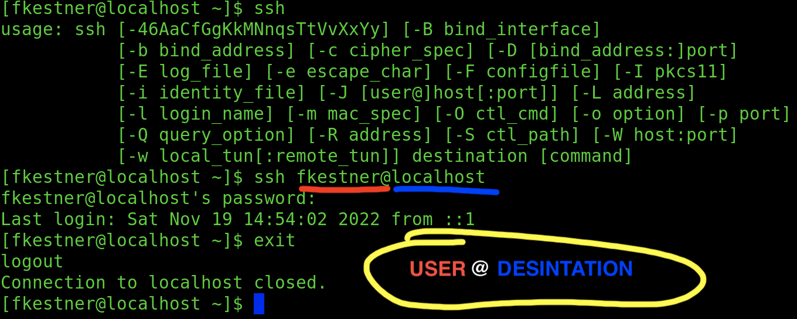
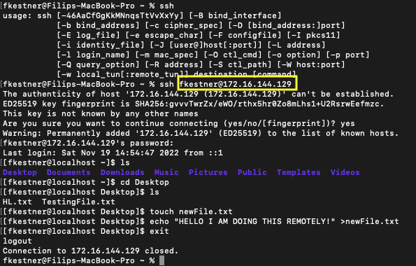
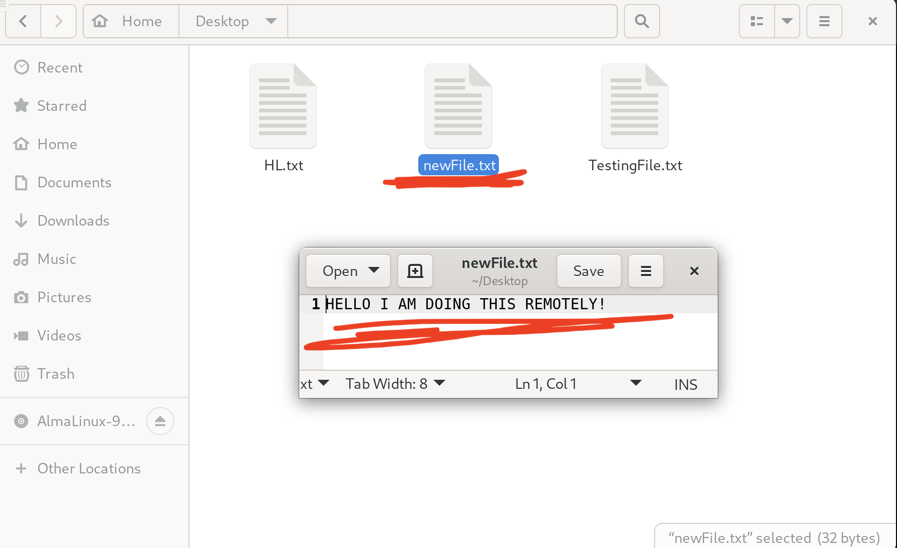
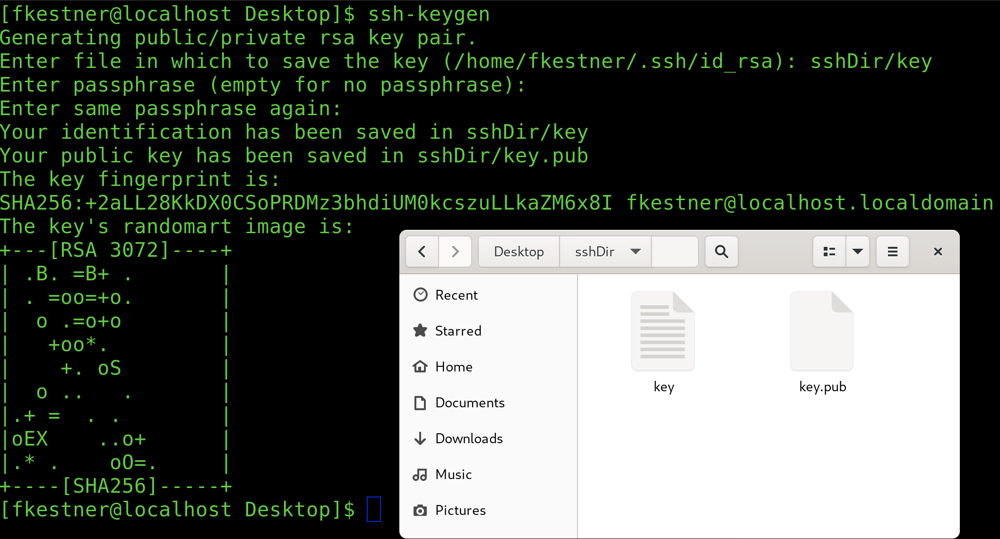
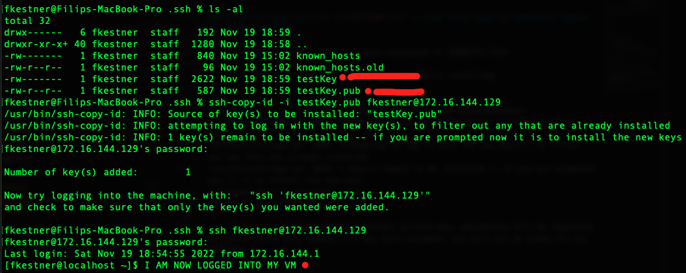
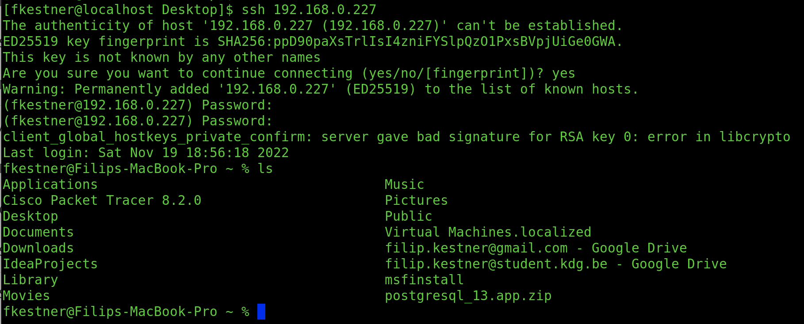
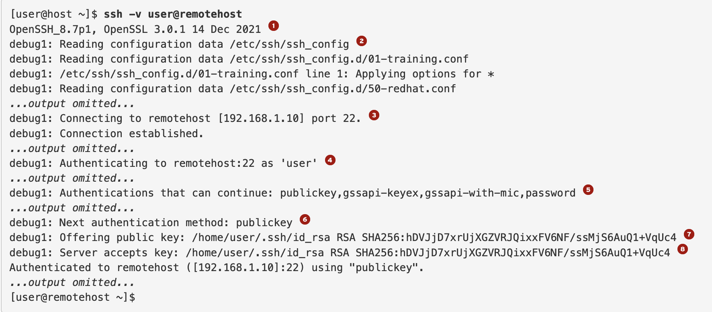
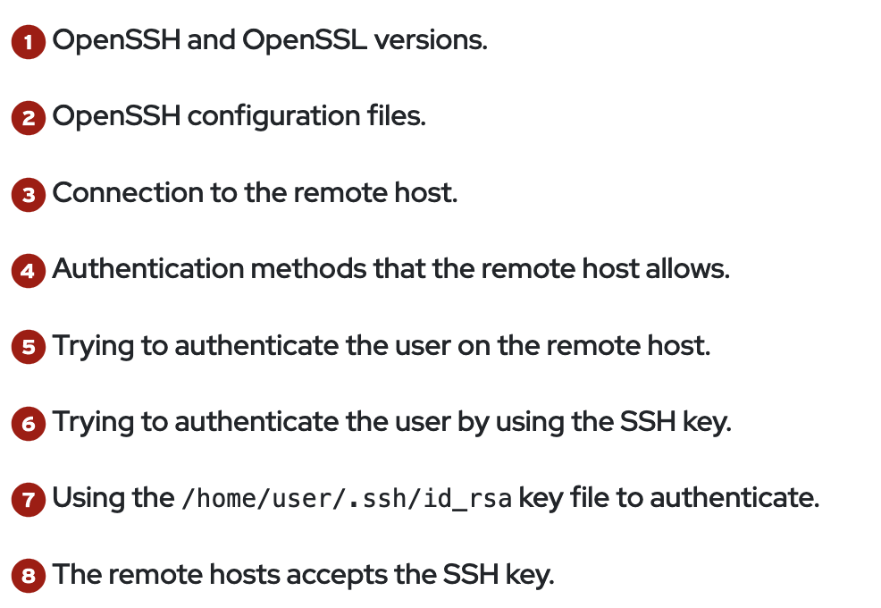
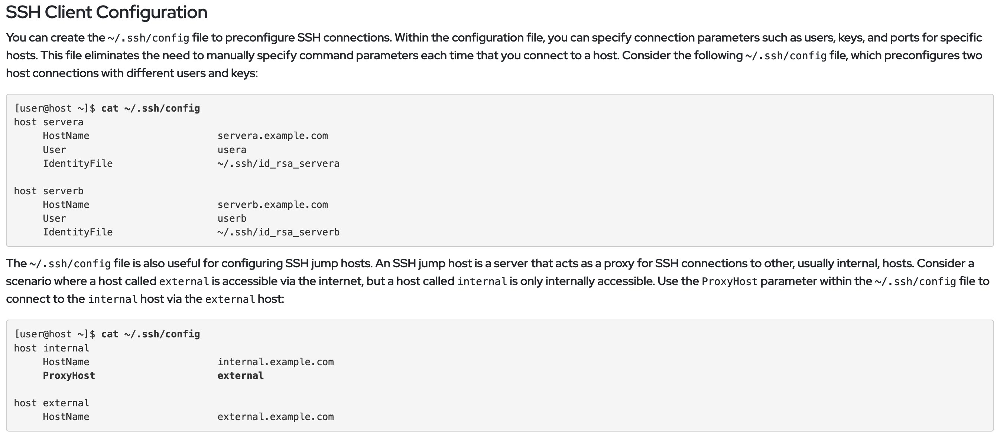

<style>
body{
  font-family: PT Mono;
  background-color: #202020;
  color: White;}
}</style>

<style>
r  { color: Red }
o  { color: Orange }
b  { color: Blue }
y  { color: Yellow }
lb { color: DeepPink}
db { color: DodgerBlue}
pr { color: MediumOrchid}
aq { color : Aqua}
gr { color : ForestGreen}

hblue{background-color:DodgerBlue;
color: black;

}
</style>

# **Configuration and Secure SSH:**

### &nbsp; &nbsp; <db>SSH</db>, also known as *secure shell*, is a <lb>**cryptoraphic** network protocol</lb> used to <lb>communicate **securely over unsecure networks**</lb>

&nbsp; 

### **<o>ssh</o>** [<r>OPTION</r>] <r>**DESTINATION** </r>[<r>COMMAND</r>]:= log into a remote machine
<pre>   <strong><r>DESTINATION</r></strong> := <lb>ip</lb>, what else?
      <pr>fkestner@172.16.144.129</pr>
</pre>
```
    -4 := forces shh to use IPv4 addresses only
    -6 := forces shh to use IPv6 addresses only

    -A := enables FORWARDING of connections from auth agent (such as 
          ssh-agen (1)). Can also be specified on a per host basis in config 
          file. ** USE THIS CAUTION **
    -a := disable FORWARDING

    -c [CIPHER_SPEC] := specify the cipher for encrypting the session
                        SEE 'Ciphers' keyword in ssh_config(5) for MORE

    -D [BIND_ADDRESS:]PORT := specifies a local "dynamic" app-level 
                              port forwarding

    -f := requests ssh to GO TO BACKGROUND just before command execution


    -l LOGIN_NAME := specifies the user to log in as on the remote machine
    -p PORT       := specifies PORT to connect to on remote host
```

### <pr>**SSH General Example:**</pr>



### <pr>**SSH Practical Example:**</pr>




<pr> As you can see, I was able to connect to my virutal machine (via it's ip address) and create a text file</pr> 

&nbsp;  
&nbsp;  

### &nbsp; &nbsp;  In the case of <lb>server **public key**</lb> is <lb>changed</lb> then for successful <lb>login</lb>, <lb>you must **EDIT**</lb> '<pr>/etc/ssh/ssh_known_hosts</pr>' to  <r>**REPLACE**</r> <y>OLD public key</y>, WITH <y>NEW public key</y>

<pre>
<pr>/etc/ssh/ssh_known_hosts</pr> := stores public key for each user on ssh 
                            client. One line per usuer:
                            | [<r>USER</r>/<db>IP</db>,...] [<lb>ENCRYPTION ALGORITHM</lb>] [<y><strong>KEY</strong></y>] 

<pr>/etc/ssh/*key.pub</pr> := each remote server connection stores it's public key
                              as a <pr><strong>.pub</strong></pr> file in '<pr>/etc/ssh/</pr>'.

  <font size = 1><r>**</r>good practice to add entries that match a server's ssh_host_*key.pub 
    files to your ~/.ssh/known_hosts file or to the system-wide /etc/ssh/ssh_known_hosts file</font>
 </pre>

&nbsp;  
&nbsp;  

---

## **Configure SSH Key-based Authentication:**


### **<o>ssh-keygen</o>** [<r>OPTION</r>] := generates, manages & converts auth keys
<pre>
    Creates 2 KEYS:
        FILE_NAME      > PRIVATE KEY
        FILE_NAME.pub  > PUBLIC KEY
</pre>
```
    -f [FILE_PATH] := specifies name/path of file to save to

    -N NEW_PASSPHRASE := privdes the new passphrase
    -P PASSPHRASE     := provides the (old) passphrase

    -R HOSTNAME | [HOSTNAME]:PORT := REMOVE ALL KEYS for specified HOSTNAME  
                                     in known hosts file.


    -F HOSTNAME | [HOSTNAME]:PORT := search for specified HOSTNAME in known 
                                     hosts file, listing occurences found.
```



### **<o>ssh-copy-id</o>** [<r>OPTION</r>] := uses local keys to authorise logins on remote machines
```
    -i IDENTITY_FILE := use only keys contained in IDENTITY_FILE

    -n := dry run, simply printing keys instead of installing 
```



**<r>\*\*</r>** If configured to protect private key, passphrase will be requested by SSH on first use, however, if key auth succeeds, you will not be asked for acc password. 


&nbsp;  

### <pr>Accessing MAC from VMWare</pr>



### **Non-Interactive Authentication with Key manager:**
&nbsp; &nbsp; If you <lb>encrypt <y>private key</y> with a **passphrase**</lb>, you <lb>enter **passphrase** each time you use <y>private key</y></lb>. To circumvent, can configure *<db>ssh-agent key manager</db>* <r>to **cache passphrases**</r>.

&nbsp;  

### **<pr>eval</pr> <y>$(<o>ssh-agent</o>)**  -> TO BE ABLE TO USE <o>**ssh-agent**</o>
### **<o>ssh-agent</o>** [<r>OPTION</r>] := openSSH authentication agent
<pre>
  <lb>Holds <y>private keys</y> used for <strong>public</strong> key authentication</lb>. Using environmental variables, this agent <lb>can be located & <strong>used automatically</strong> for authentication when</lb> logging into otherm achines <lb><strong>using ssh(1)<lb>.</strong> 
</pre>
```
    -k := KILL current agent (given by $SSH_AGENT_PID)  

    -D := enable foreground mode, so ssh-agent WILL NOT FORK
```
### **<o>ssh-add</o>** [<r>KEY_FILE</r>] := adds <y>private key</y> identities to openSSH agent
```
    -c := indicates added identities should be SUBJECT TO CONFIRMATION 
          BEFORE USE

    -l := lists fingerprint of all identities currently repr by agent
    -L := lists public key parameters of all identities repr by agent

    -D := DELETES all identities from agent
    -d := instead of add, REMOVE identities provided from agent


    -x := LOCK with password
    -X := UNLOCK
```

&nbsp;  

### **Basic SSH Connection Troubleshooting:**





&nbsp;  

### <r>**</r> A *custom* config file can be created '<pr>~/.ssh/config</pr>' & used to ***<db>preconfigure</db> <pr>ssh connections</pr>***. 


&nbsp;  

---

## **Customize OpenSSH Service Configuration:**

### <r>(1)</r> Prohibit the <db>Superuser</db> from Logging On: 
<pre>
      ** The <lb><strong>root user</strong></lb> name <y>EXISTS ON EVERY LINUX SYSTEM BY <r><strong>DEFAULT</strong></r></y>

      <pr>/etc/ssh/sshd_config</pr> -> file that controls login permissions

      |PermitRootLogin <gr>yes</gr> <i>--CHANGE TO--></i> |PermitRootLogin <r>no</r>

      <r><strong><i>systemctl reload sshd</i></strong></r>
</pre>

### <r>(2)</r> Prohibit Password-based Auth for SSH:
<pre>
    ** We do this so : attackers <strong><r>CANNOT USE PASSWORD-GUESSING ATTACKS</r></strong>
    
     <pr>/etc/ssh/sshd_config</pr> -> password based auth toggle
     
     |PasswordAuthentication <gr>yes</gr> <i>--CHANGE TO--></i> |PasswordAuthentication <r>no</r>

     <r><strong><i>systemctl reload sshd</i></strong></r>

</pre>