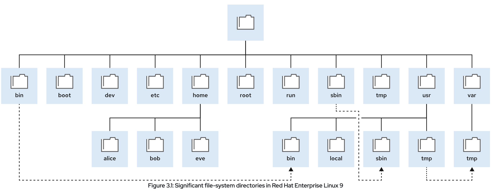
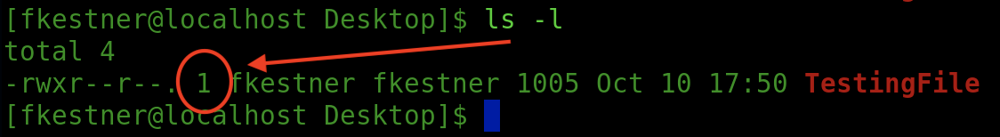
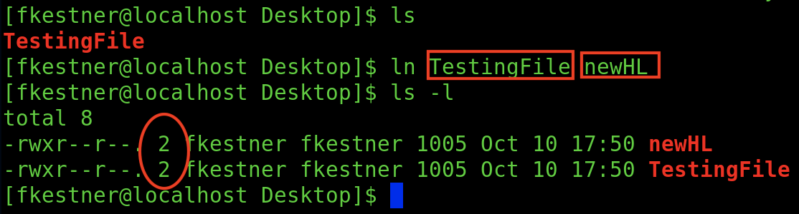
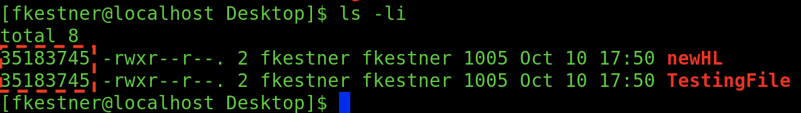
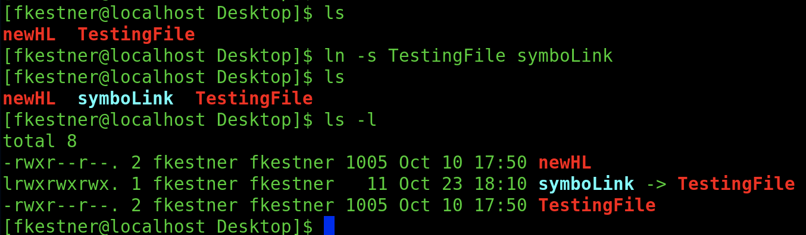
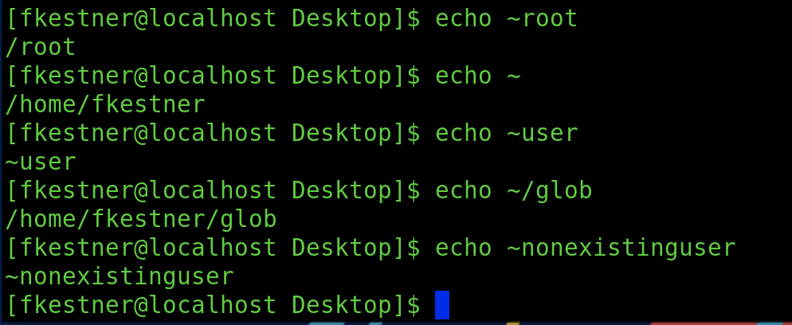

<style>
r { color: Red }
o { color: Orange }
b { color: Blue }
y { color: Yellow }
lb { color: DeepPink}
db { color: DodgerBlue}
pr { color: Purple }
</style>

<style>
body{
  font-family: PT Mono;
  background-color: #202020;
  color: White;
}</style>


# Unix Files, Navigation and More


## General Useful Commands: 
---

### **<span style="color:orange">whoami</span>**  := returns current userID
```shell
[fkestner@localhost ~]$ whoami 
fkestner
```  
&nbsp;  


### **<span style="color:orange">passwd</span>**  :=  changes current user's password
```shell
[fkestner@localhost ~]$ passwd
Changing password for user fkestner.
Current password: *********
New password: *********
```  
&NewLine;  
&NewLine;  
## Basic File Reading
---
&NewLine;  
&NewLine;  

### **<span style="color:orange">file</span>** [ **<span style="color:red">PATH</span>** ]  := Determines file type of [ **<span style="color:red">PATH</span>** ]
```shell
cat [OPTION] [FILE/PATH] '[FILE/PATH]' -> Concatenate files and print to stdout
	-A  := show all (eq. to -vET) 
	-b  := numbers nonempty output lines 
	-n  := number ALL output lines 
```
&nbsp;  

### **<span style="color:orange">head</span>** [ **<span style="color:red">OPTION</span>** ] [ **<span style="color:red">FILE_PATH</span>** ] := Output FIRST 10 lines of a given file
```shell
	-n[NUM]   := prints NUM lines instead of first 10 
    -[NUM]   := with '-' it prints ALL LINES EXCEPT LAST NUM 

	-c[NUM]   := print NUM bytes in file instead of 10 first
	-[NUM]   := print ALL bytes EXCEPT LAST NUM amount
```
&nbsp;  

### **<span style="color:orange">tail</span>** [ **<span style="color:red">OPTION</span>** ] [ **<span style="color:red">FILE_PATH</span>** ] := Output LAST 10 lines of a given file
```shell
	-n[NUM]  := output last [NUM] lines instead of last 10
    +[NUM]  := output starting from line NUM 

	-c[NUM]  := output last [NUM] bytes
	+[NUM]  := output each line starting from NUM byte in each line
```
&nbsp;  

### **<span style="color:orange">less</span>** [ **<span style="color:red">FILE_PATH</span>** ] := go through a file
```
    -M := display line numbers
```

### **<span style="color:orange">wc</span>** [ **<span style="color:red">OPTION</span>** ] [ **<span style="color:red">FILE_PATH</span>** ] := print newLine Char, byte and word count

###  &nbsp; &nbsp; &nbsp; &nbsp;[ **<span style="color:red">FILE_RANGE</span>** ] ?= Figure out what I meant here

&nbsp;&nbsp;&nbsp;&nbsp;&nbsp;&nbsp;&nbsp;<span style="color:SteelBlue">**When there is NO FILE or file == '-', it reads STDIN</span>
```shell
	-c  := print byte count
	-m  := print char count
	-l  := print newline count
	-L  := print maximum display width
	-w  := print word count 
```

### **<span style="color:orange">history</span>** := displays contents designated history file (history of commands)
```
	-c := clears the history file
```
&nbsp;  

#### <span style="color:SteelBlue">SideNote:</span>
&nbsp;&nbsp;&nbsp;&nbsp;<span style="color:SteelBlue">** ' \ ' escape char lets you write commands on multiple lines</span>  
&nbsp;&nbsp;&nbsp;&nbsp;<span style="color:SteelBlue">** ' ; ' ends a command and lets you write another. LIKE JAVA</span>  


	

&NewLine;  
&NewLine;  
## Structure of the Root Folder:
---


<span style="color:#fff; font-family: 'PT Mono'; font-size: 1em;">/boot := Files to START BOOT PROCESS.</span>

<span style="color:#fff; font-family: 'PT Mono'; font-size: 1em;">/dev &nbsp;:= Special DEVICE FILES that the SYSTEM USES TO ACCESS HARDWARE.</span>


<span style="color:#fff; font-family: 'PT Mono'; font-size: 1em;">	/etc &nbsp;:= CONFIG FILES.</span>

<span style="color:#fff; font-family: 'PT Mono'; font-size: 1em;">	/home := Regular users store data and config files.</span>

<span style="color:#fff; font-family: 'PT Mono'; font-size: 1em;">	/root := Home directory of ROOT or SU USER.</span>

<span style="color:#fff; font-family: 'PT Mono'; font-size: 1em;">	/run &nbsp;:= Runtime data for processes that started since the last boot. Process ID files and lock files. 
		The contents of this directory are re-created on reboot.</span>

<span style="color:#fff; font-family: 'PT Mono'; font-size: 1em;"> /tmp &nbsp;:= A world-writable space for temporary files. Files that are not accessed, changed, or modified for 10 days are deleted from this directory automatically. The /var/tmp directory is also a temporary directory, in which files that are not accessed, changed, or modified in more than 30 days are deleted automatically.</span>

<span style="color:#fff; font-family: 'PT Mono'; font-size: 1em;">	/usr &nbsp;&nbsp;:= Installed software, shared libraries, including files, and read-only program data. 
		Significant subdirectories include:
		</br>
		&nbsp;&nbsp;&nbsp;&nbsp;<span style="color:Yellow">/usr/bin:</span>
    			User commands.
		</br>
		&nbsp;&nbsp;&nbsp;&nbsp;<span style="color:Yellow">/usr/sbin:</span>
    			System administration commands
		</br>
		&nbsp;&nbsp;&nbsp;&nbsp;<span style="color:Yellow">/usr/local:</span>
   		 	    Locally customized software.</span>

<span style="color:#fff; font-family: 'PT Mono'; font-size: 1em;">	/var &nbsp;&nbsp;:= System-specific variable data should persist between boots. Files that dynamically change, such as databases, cache directories, log files, printer-spooled documents, and website content, might be found under /var. </span>
&nbsp;  
&nbsp;  


## Manipulating the File System:
---


### **<span style="color:orange">pwd</span>** := get absolute path to current directory
&nbsp;  


### **<span style="color:orange">touch</span>** [ **<span style="color:red">OPTION</span>** ] [ **<span style="color:red">PATH</span>** ]  := Changes file access timestamps, but CAN CREATE A FILE.
```shell
    -c, --no-create      := do not create any files
    -h, --no-dereference := affect symbolic link instead of referenced file.
                            (useful only on sys. that can change timestamps of a symlink)
```
&nbsp;  


#### <span style="color:SteelBlue">SideNote:</span>
&nbsp;&nbsp;&nbsp;&nbsp;<span style="color:SteelBlue">** File names beggining with ' . ' are HIDDEN FILES </span>  
```shell
    USE THIS to SHOW HIDDEN FILES ANY DIRECTORIES:
        | ls -A 
 ```
 &nbsp;  


### **<span style="color:orange">mkdir</span>** [ **<span style="color:red">OPTION</span>** ] [ **<span style="color:red">PATH</span>** ]  := Make a directory 
```shell
	-p  := make parent directories as needed **Generates NO ERROR MESSAGES
	-v  := 'verbose' print message for each dir created
```
 &nbsp; 

### **<span style="color:orange">mv</span>** [ **<span style="color:red">OPTION</span>** ] [ **<span style="color:red">SOURCE_PATH</span>** ] [ **<span style="color:red">DEST_PATH</span>** ]  := Move OR RENAME file/directory
```shell
	-b  := backup 
	-n  := 'no clobber' meaning DO NOT OVERWRITE
```
 &nbsp; 

### **<span style="color:orange">rm</span>** [ **<span style="color:red">OPTION</span>** ] [ **<span style="color:red">PATH</span>** ]  := Remove file or directory
```shell
	-i  := prompt before every removal 
	-r, R, --recursive  := remove RECURSIVELY
	-d, --dir := remove any EMPTY directories
	-v  := display what is being done 
    -f  := ignore nonexsitent files and args, never prompt
```
&nbsp;&nbsp;&nbsp;&nbsp;<span style="color:SteelBlue">** Using 'rm -if ...' WILL NOT prompt you before every removal as the -f options takes precidence. </span>  
 &nbsp; 

### **<span style="color:orange">rmdir</span>** := Removes empty directories
 &nbsp; 
 &nbsp; 


## Links Between Files
---

You can create multiple file name that point to the same file. These file names are called links. You can create two types of these links: Hard Links & Soft Links. 

### **<span style="color:DodgerBlue">Hard Links:</span>**  
    := Another file that points to the SAME DATA, acting exactly as the original file. After creation there is no difference between original nad new Hard Link file.

### You can determine how many HLs a file has by executing the following command:

 &nbsp; 


### To Create a Hard Link: 

### **<span style="color:orange">ln</span>** [ **<span style="color:red">OPTION</span>** ] [ **<span style="color:red">TARGET</span>** ] [ **<span style="color:red">DESTINATION</span>** ]  := Make a new link
```shell
	-b  := make a backup of each existing destination file
    -f  := remove existing destination files
    -i  --interactive := prompt when removing destinations
    -L  --logical     := dereference TARGETs that are symbolic links
    -s  := creates symbolic link 
```



 **To check if there is a *<span style="color:DodgerBlue">Hard Link</span>* between files execute the following command (' ln -i ') and compare the inode numbers (circled in red below).
 
 

 ** Even if the original file is deleted you CAN STILL ACESS THE CONTENTS provided there is at least one other HL that exists. Data is deleted from storage whith the LAST HL. 

### <span style="color:Red">Limitations of Hard Links:</span>
```
    - You can only use Hard Links with regular files (no dir or special files)
    - Can only use HL if both files ARE IN THE SAME FILE SYSTEM (Ex. Diff. Mounted Dir)
```

### **<span style="color:orange">df</span>** := List all dirs on different file systems
&nbsp;  
&nbsp;   

### **<span style="color:DodgerBlue">Symbolic Links:</span>**  
    := Also known as a 'Soft Link' , not a regular file but a special type of file that points to an existing FILE OR DIRECTORY. 

    A symbolic link pointing to a directory ACTS as that directory. So when you switch to the symbolic link it takes to the appropriately linked directory. 

### <span style="color:Green">Advantages Over Hard Links:</span>
```
    - Symbolic links can link two files on different systems
    - Symbolic links can point to a directory or special file, not just to a regular file. 
```
### To Create a Symbolic Link: 
```
    ln -s [OPTIONS] [TARGET] [DESTINATION]
```


&nbsp;&nbsp;&nbsp;&nbsp;** The '-' missing and 'l' in its place before the symboLink file indicates that it is a <span style="color:DodgerBlue">SYMBOLIC LINK </span>

&nbsp;&nbsp;&nbsp;&nbsp;** When a file with a symbolic link gets deleted, the <span style="color:DodgerBlue">SYMBOLIC LINK </span> becomes a <span style="color:red">DANGLING SYMBOLIC LINK </span>
&nbsp;  
&nbsp;  

### A <span style="color:DodgerBlue">HARD LINK </span> POINTS TO DATA
### A <span style="color:DodgerBlue">SYMBOLIC LINK </span> POINTS A NAME TO ANOTHER NAME
&nbsp;  
&nbsp;  

## Match File Names with Shell Expansions:
---
### Pattern Matching:
| Pattern	| Matches |
|-----------|---------|
| *	        | Any string of zero or more characters.
| ?	        |Any single character.
|[abc…​]	     |Any one character in the enclosed class (between the square brackets).
|[!abc…​]	 |Any one character not in the enclosed class.
|[^abc…​]	 |Any one character not in the enclosed class.
|[[:alpha:]]	|Any alphabetic character.
|[[:lower:]]	|Any lowercase character.
|[[:upper:]]	|Any uppercase character.
|[[:alnum:]]	|Any alphabetic character or digit.
|[[:punct:]]	|Any printable character that is not a space or alphanumeric.
|[[:digit:]]	|Any single digit from 0 to 9.
|[[:space:]]	|Any single white space character, which might include tabs, newlines, carriage returns, form feeds, or spaces.
---
&nbsp;  
&nbsp;  

### Tilde Expansion:
&nbsp;&nbsp;&nbsp;&nbsp; Tilde <span style="color:Yellow">(~) matches the current user's home directory. </span>  If it starts with a string of characters other than slash (/), then the shell interprets the string up to the slash as a user name. 




### Brace Expansion:
&nbsp;&nbsp;&nbsp;&nbsp; Used to generate discretionary strings of characters. So basically all strings of characters seperated by a comma, is used to create multiple versions with each string in the brackets:

```
[user@host glob]$ echo {Sunday,Monday,Tuesday,Wednesday}.log
        Sunday.log Monday.log Tuesday.log Wednesday.log

[user@host glob]$ echo file{1..3}.txt
        file1.txt file2.txt file3.txt

[user@host glob]$ echo file{a..c}.txt
        filea.txt fileb.txt filec.txt

[user@host glob]$ echo file{a,b}{1,2}.txt
        filea1.txt filea2.txt fileb1.txt fileb2.txt

[user@host glob]$ echo file{a{1,2},b,c}.txt
        filea1.txt filea2.txt fileb.txt filec.txt
```

### Variable Expansion:
&nbsp;&nbsp;&nbsp;&nbsp; A variable acts like a named container, storing a value in memory. Variables simplify accessing and modifying the stored data either from the command line or within a script. 

#### Declare a Variable:
```shell
[user@host ~]$ VARIABLENAME=value
```

#### Use a Variable:
```shell
[user@host ~]$ USERNAME=operator
[user@host ~]$ echo $USERNAME
    operator
---------------------------------
[user@host ~]$ USERNAME=operator
[user@host ~]$ echo ${USERNAME}
    operator
```

#### Command Subtitution: 
&nbsp;&nbsp;&nbsp;&nbsp; Allows the output of a command to replace the command itself on the command line. Basically enclosing a command in another command. 
```shell
[user@host glob]$ echo Today is $(date +%A).
Today is Wednesday.

[user@host glob]$ echo The time is $(date +%M) minutes past $(date +%l%p).
The time is 26 minutes past 11AM.
```

#### &nbsp;&nbsp;&nbsp;&nbsp;Escape Characters:
&nbsp;&nbsp;&nbsp;&nbsp;&nbsp;&nbsp;&nbsp;&nbsp; Double Quotations (" ") Marsks Supressing Globbing & Shell Expansion

```
[user@host glob]$ myhost=$(hostname -s); echo $myhost
host

[user@host glob]$ echo "***** hostname is ${myhost} *****"
***** hostname is host *****
```

&nbsp;&nbsp;&nbsp;&nbsp;&nbsp;&nbsp;&nbsp;&nbsp; Single Quotes (' ') to Interpret ALL TEXT LITERALLY:
```
[user@host glob]$ echo "Will variable $myhost evaluate to $(hostname -s)?"
Will variable host evaluate to host?

[user@host glob]$ echo 'Will variable $myhost evaluate to $(hostname -s)?'
Will variable $myhost evaluate to $(hostname -s)?
```


