<style>
r { color: Red }
o { color: Orange }
b { color: Blue }
y { color: Yellow }
lb { color: DeepPink}
db { color: DodgerBlue}
pr { color: Purple }
</style>

<style>
body{
  font-family: PT Mono;
  background-color: #202020;
  color: White;
}</style>


# **Create, View and Edit Text Files:**
---
&nbsp; 
&nbsp;  
&nbsp; 
&nbsp; 


## I/O Streams (Standard Input, Output & Error)
---
&nbsp; 

<span style="color:#fff; font-family: 'PT Mono'; font-size: 1em;"> When it comes to IO there exist THREE main channels: 
&nbsp;  
&nbsp;&nbsp;&nbsp;&nbsp;&nbsp;&nbsp; 0 := Standard Input, reads from keyboard
&nbsp;  
&nbsp;&nbsp;&nbsp;&nbsp;&nbsp;&nbsp; 1 := Standard Output, sends to terminal
&nbsp;  
&nbsp;&nbsp;&nbsp;&nbsp;&nbsp;&nbsp; 2 := Standard Error, sends errors to terminal
&nbsp;  
Custom channels can also be created:
&nbsp;  
&nbsp;&nbsp;&nbsp;&nbsp;&nbsp;&nbsp; 3+ := Custom channels with custom function
&nbsp;  
&nbsp;  
</span>


| Number	| Channel name	| Description	| Default connection	| Usage |
|-----------|---------------|---------------|-----------------------|-------|
0	| stdin | 	Standard input	| Keyboard	| read only
1	|stdout 	|Standard output	|Terminal	|write only
2	|stderr 	|Standard error	|Terminal	|write only
3+	|filename 	|Other files	|none	|read, write, or both
---


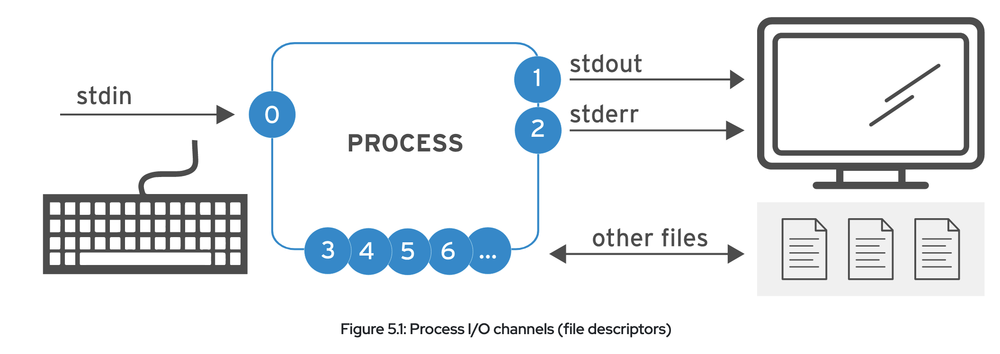

## How To Redirect Output: 


## **[<r>COMMAND</r>]** &nbsp; **[<o> REDIRECTION</o>]** &nbsp; **[<r>DESTINATION_FILE</r>]** 
<span style="color:#fff; font-family: 'PT Mono'; font-size: 1em;"> 

&nbsp; &nbsp; &nbsp; &nbsp; [<r>COMMAND</r>] &nbsp;&nbsp;&nbsp;&nbsp;&nbsp;&nbsp;&nbsp;&nbsp;&nbsp;:= Some command with an output  

&nbsp; &nbsp; &nbsp; &nbsp; [<o>REDIRECTION</o>] &nbsp;&nbsp;&nbsp;&nbsp;&nbsp;:= Redirection character

&nbsp; &nbsp; &nbsp; &nbsp; [<r>DESTINATION_FILE</r>] := Destination file path
</span>
&nbsp;   
&nbsp;   
&nbsp;   

### &nbsp; &nbsp;&nbsp; <db>cmd</db> **<o>></o>** <db>path</db> &nbsp; : <lb>REDIRECTS</lb> & <lb>OVERWRITES</lb> *stdout* into file at path

### &nbsp; &nbsp;&nbsp; <db>cmd</db> **<o>>></o>** <db>path</db> &nbsp;: <lb>REDIRECTS</lb> & <lb>APPENDS</lb> *stdout* into file at path

### &nbsp; &nbsp;&nbsp; <db>cmd</db> **<o>2></o>** <db>path</db> &nbsp;: <lb>REDIRECTS</lb> & <lb>OVERWRITES</lb> *stderr* into file at path

### &nbsp; &nbsp;&nbsp; <db>cmd</db> **<o>2>/dev/null</o>** <db>path</db> : <lb>DISCARDS</lb> *stderr* by redirecting to *'<r>/dev/nul</r>'*
&nbsp;

### &nbsp; &nbsp;&nbsp; {<db>cmd</db> **<o>></o>** <db>path</db> **<o>2>&1</o>** : <lb>REDIRECTS</lb> & <lb>OVERWRITES</lb> *stdout* & *stderr* } OR 

### &nbsp; &nbsp;&nbsp; {<db>cmd</db> **<o>&></o>** <db>path</db> &nbsp; &nbsp; : into the SAME file &nbsp; &nbsp; &nbsp; &nbsp; &nbsp; &nbsp; &nbsp; &nbsp; &nbsp; &nbsp; } 
&nbsp;

### &nbsp; &nbsp;&nbsp; {<db>cmd</db> **<o>>></o>** <db>path</db> **<o>2>&1</o>** : <lb>REDIRECTS</lb> & <lb>APPENDS</lb> *stdout* & *stderr* } OR 

### &nbsp; &nbsp;&nbsp; {<db>cmd</db> **<o>&>></o>** <db>path</db> &nbsp; &nbsp; : into the SAME file &nbsp; &nbsp; &nbsp; &nbsp; &nbsp; &nbsp; &nbsp; &nbsp; &nbsp;}
&nbsp;  
&nbsp;  

### ** The <r>ORDER</r> in which you perform <o>REDIRECTION</o> is also VERY IMPORTANT:
```
    Redirects stdout and THEN stderr to output.log
        > output.log 2>&1

    Redirects stderr to default place for stdout AND THEN REDIRECTS ONLY stdout to output.log
         2>&1 > output.log
```
## **<pr> Examples of Redirection: </pr>**
### Standard Redirection
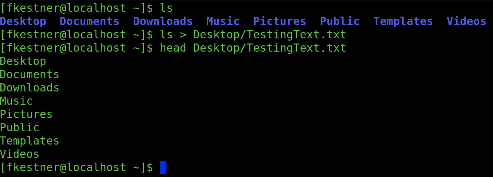
### Append Output and Generated Errors to Desktop/TestingFile.txt
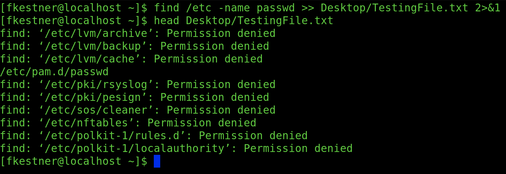

### Redirects stderr TO CHANNEL 1 DEFAULT, and stdout to TestingFile.txt
### <r> KEEP IN MIND ORDER! If you do '>' first then 2>&1 REDIRECTS stderr ALSO TO TestingFile.txt</r>
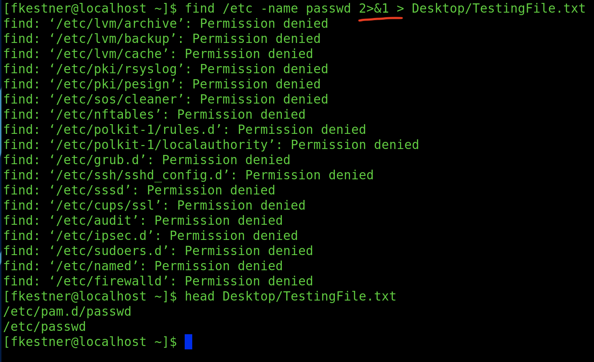
&nbsp;  
&nbsp;  
&nbsp; 

## Pipelines:
---
### A <o>pipeline</o> is a <lb>sequence of one or more commands that are seperated by</lb> '**<o>|</o>**'.
### Connects <db>OUTPUT</db> of first command to <db>INPUT</db> of second command.
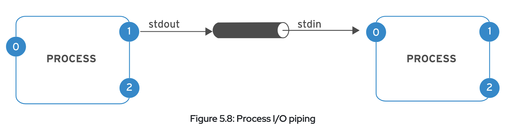


## **<db>Combining Pipelines & Redirection:</db>**
### &nbsp; &nbsp; When you <o>combine</o>, the shell <lb>sets up the ENTIRE PIPELINE FIRST</lb> and then <r>REDIRECTS</r>. Because of this, if you <lb>REDIRECT</lb> to FILE in the MIDDLE OF A PIPELINE, then <output goes to FILE <r>NOT NEXT COMMAND</r>
&nbsp;  
### To circumvent this we use: 

### **<o>tee</o>** [**<r>OPTIONS</r>**] [**<r>FILE_PATH</r>**] := read from stdin and write to stdout AND FILE_PATH
```shell
cat [OPTION] [FILE/PATH] '[FILE/PATH]' -> Concatenate files and print to stdout
	-a  := append to the given FILES, do not overwrite
	-i  := ignore interrupt signals
```
&nbsp; 

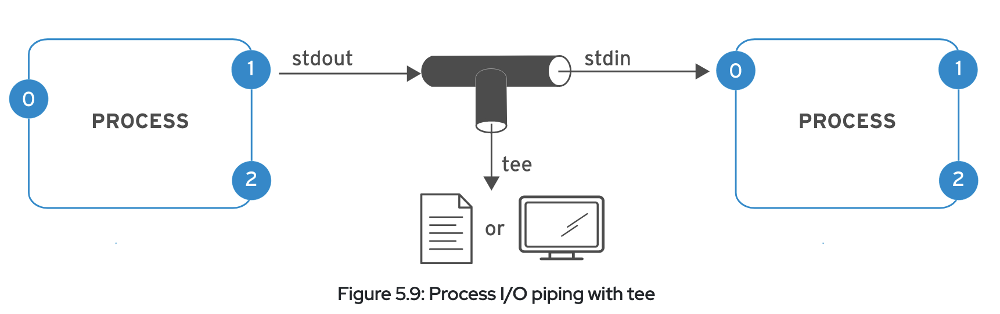

## **<pr> Examples using </pr>** <o>tee</o><pr>:</pr>

### Redirecting to File and 'head' command
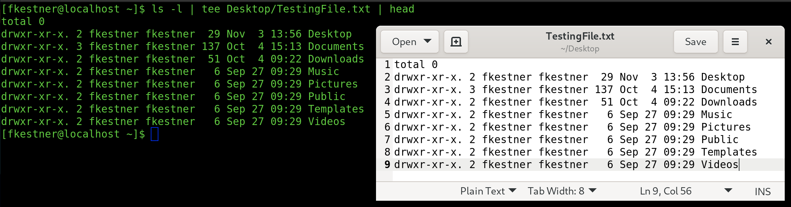

### <r>**YOU CAN REDIRECT STDERR THROUGH PIPELINE BUT CANNOT USE MERGING REDIRECTION OPERATORS (&> AND &>>)</r>. The proper way: 
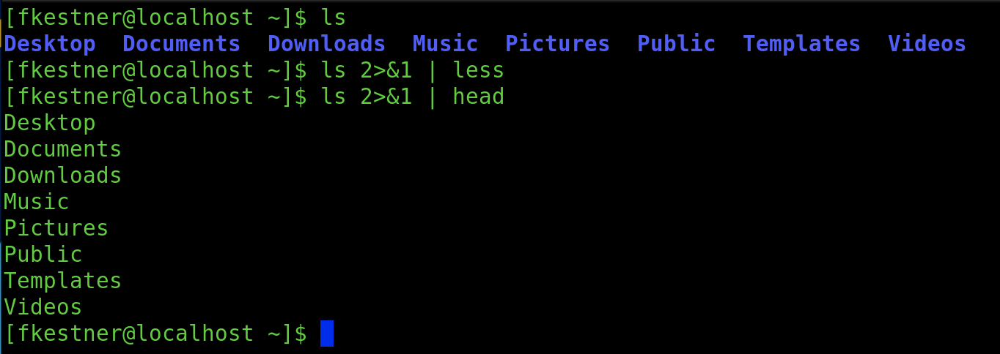
&nbsp;  ss
&nbsp;  
&nbsp;  
## Edit Text Files from Shell Prompt:
---
### There are a number of different built-in ways of editing text files on linux systems. Some of those systems include <db>nano</db> and <db>visudo</db>. The most used and improved editor however is: **<o>vim</o>**
&nbsp; 

### The biggest reason to use <o>vim</o> is that is is almost always <lb>installed by default on server</lb> for editing text-based files.
&nbsp; 
&nbsp;  
&nbsp; 
### **<o>vi</o>** [**<r>FILE_PATH</r>**] &nbsp;:= opens [**<r>FILE_PATH</r>**] wih the basic <o>vi</o> editor. 
### **<o>vim</o>** [**<r>FILE_PATH</r>**] := opens [**<r>FILE_PATH</r>**] wih the advanced <o>vim</o> editor. 
&nbsp; 
### <o>Vim</o> Operating Modes:
### &nbsp; &nbsp; &nbsp; &nbsp; <db>i</db> := insert mode
### &nbsp; &nbsp; &nbsp; &nbsp; <db>v</db> := visual edit mode
### &nbsp; &nbsp; &nbsp; &nbsp; <db>:</db> := extended command mode
### &nbsp; &nbsp;<r>**</r> If you are unsure which mode you are in, press <db> ESC </db> a few times to safely return to command mode. 
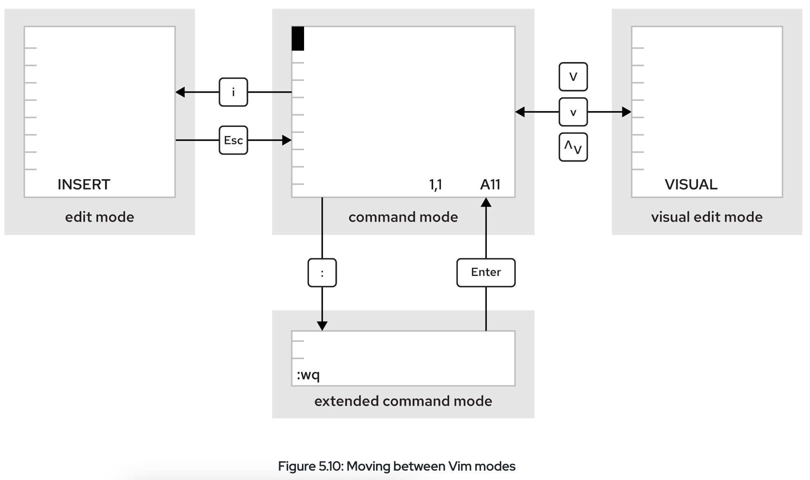

### MUST KNOW <o>VIM</o> COMMANDS:
### &nbsp; &nbsp; &nbsp; &nbsp; <db>u</db> key := UNDOES most recent edit.
### &nbsp; &nbsp; &nbsp; &nbsp; <db>x</db> key := DELETES SINGLE CHARACTER
&nbsp;  
### &nbsp; &nbsp; &nbsp; &nbsp; <db>:w</db> &nbsp;:= writes (saves) the file and remains in command mode for editing.
### &nbsp; &nbsp; &nbsp; &nbsp; <db>:wq</db> := writes (saves) the file and quits VIM.
### &nbsp; &nbsp; &nbsp; &nbsp; <db>:q!</db> := quits VIM and DISCARDS ALL CHANGES. 
&nbsp;  
### REARRANGE & SELECT EXISTING TEXT:
### &nbsp; &nbsp; <o>Character Mode</o>: <db> v </db>
### &nbsp; &nbsp; <o>Line Mode</o>&nbsp;&nbsp;&nbsp;&nbsp;&nbsp;: <db> Shift+v </db> 
### &nbsp; &nbsp; <o>Block Mode</o>&nbsp;&nbsp;&nbsp;&nbsp;: <db> Ctrl+v </db>
&nbsp;  
### COPY/PASTE IN COMMAND MODE:
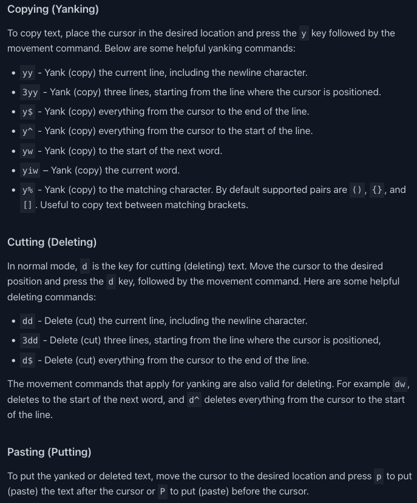


&nbsp;   
### COPY/PASTE IN SELECT MODE:
### &nbsp; &nbsp; 1. Enter <o>CHAR/LINE/BLOCK</o> mode
### &nbsp; &nbsp; 2. Select some text
### &nbsp; &nbsp; 3. Press <r>y</r> to COPY or <r>d</r> to CUT
### &nbsp; &nbsp; 4. Press <lb>P</lb> to paste BEFORE cursor, <lb>p</lb> for AFTER cursor.
&nbsp;   
&nbsp;   
### ** <r>/etc/vimrc</r> & <r>~/.vimrc</r> are <o>vim</o> configuration files for entire system OR specific users. Can specify stuff like <lb>default tab spacing</lb>, <lb>syntax highlighting</lb>, <lb>color schemes</lb>, and MORE.
&nbsp;  
&nbsp;  
&nbsp;  
## Edit the Shell Environment:
---
### Shell Variables:
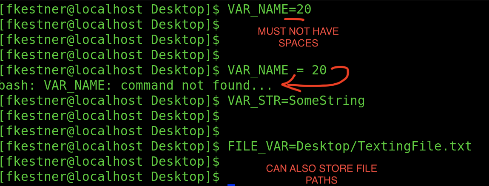
&nbsp;  
### ** <r>Variables are contained only in the shell they are created in, not all instances running on the same server/system. </r>
&nbsp;  
&nbsp;  
### <o> set </o> := lists all shell variables (& functions) currently set
```shell
[fkestner@localhost Desktop]$ set | less
```
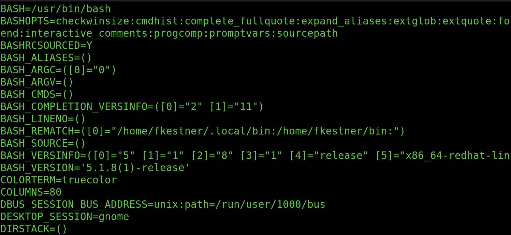
&nbsp;  
### How to retrieve variable values:
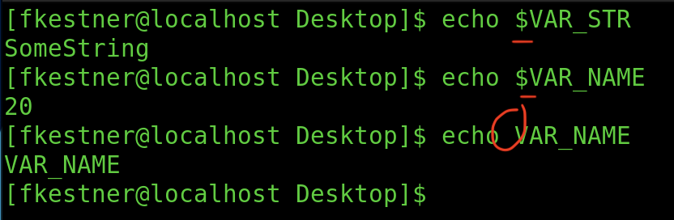
&nbsp;  
&nbsp;  
### Setting & Editing Environment Variables:
```
Exporting a Shell Var into an Environmental Var:
    [...]$ EDITOR=vim        
    [...]$ export EDITOR
              OR
    [...]$ export EDITOR=vim

    Examples of Environmental Variables:

    ~ Changing Language of Environment:
        [user@host ~]$ date
        Tue Jan 22 16:37:45 CST 2019
        [user@host ~]$ export LANG=fr_FR.UTF-8
        [user@host ~]$ date
        mar. janv. 22 16:38:14 CST 2019

    ~ Changing Where Commands are Found in Shell
        $PATH := a list of colon-seperated dirs that contain programs
        ** When you run a command in a terminal it looks at these directories for what to do.

        To Append to $PATH:
            [user@host ~]$ export PATH=${PATH}:/home/user/sbin

    ~ Set Default Text Editor:
        [user@host ~]$ export EDITOR=nano

```
### Get list of all environmental variables (use <o>env</o> command):
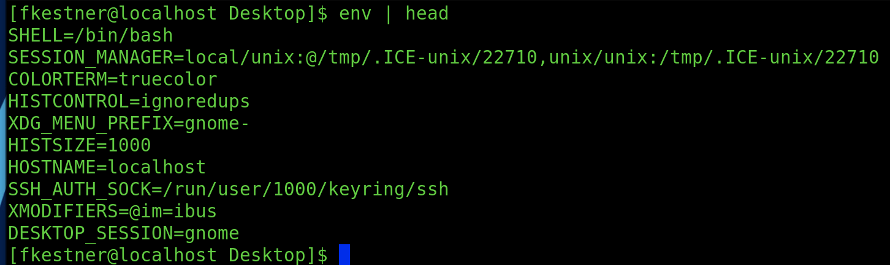
&nbsp;  

### Setting Variables Automatically: 
When BASH starts, several text files run with shell commands that initialize the environment. To set shell/environmental vars automatically on shell start up, you can <lb>EDIT BASH STARTUP SCRIPTS</lb>
&nbsp;  
&nbsp;  
What determines exactly which startup script is used are 2 things: 

&nbsp;  &nbsp;  &nbsp;  &nbsp;  1. <lb>INTERACTIVE</lb> OR <lb>NON-INTERACTIVE</lb> SHELL

&nbsp;  &nbsp;  &nbsp;  &nbsp;  2. <lb>LOG-IN</lb> OR <lb>NON-LOGIN</lb> SHELL
&nbsp; 
&nbsp;  

For <y>interactive log-in shell</y>&nbsp;&nbsp;&nbsp;&nbsp; : <r>/etc/profile</r> AND <r>~/.bash_profile</r> 

&nbsp;&nbsp;&nbsp;&nbsp;&nbsp;&nbsp;&nbsp;&nbsp;&nbsp;&nbsp;&nbsp;&nbsp;&nbsp;&nbsp;&nbsp;&nbsp;&nbsp;&nbsp;&nbsp;&nbsp;&nbsp;&nbsp;&nbsp;&nbsp;&nbsp;&nbsp;&nbsp;&nbsp;&nbsp;&nbsp;&nbsp;&nbsp;&nbsp;: (<lb>/etc/bashrc</lb> AND <lb>~/.bashrc</lb> also sourced respectively)


For <y>interactive non-log-in shell</y> : ONLY <r>/etc/bashrc</r> AND <r>~/.bashrc </r> 
&nbsp;  
&nbsp;  

**<r>/etc/profile</r> AND <r>~/.bash_profile</r> are USER-SPECIFIC, while <r>/etc/bashrc</r> AND <r>~/.bashrc </r> APPLY TO WHOLE SYSTEM
&nbsp;  
&nbsp;  

### Aliases:
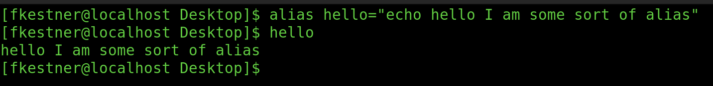

```
TO UNSET A VARIABLE: 
    [user@host ~]$ echo $file1
    /tmp/tmp.z9pXW0HqcC
    [user@host ~]$ unset file1
    [user@host ~]$ echo $file1

    [user@host ~]$

TO UNEXPORT WITHOUT UNSETTING, USE 'export -n'
    [user@host ~]$ export -n PS1
```