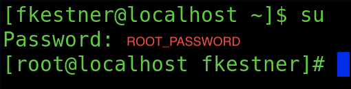
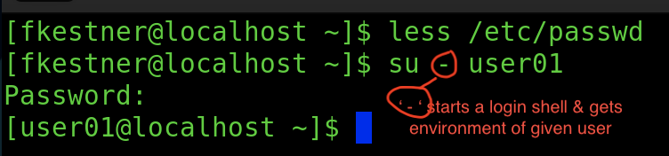
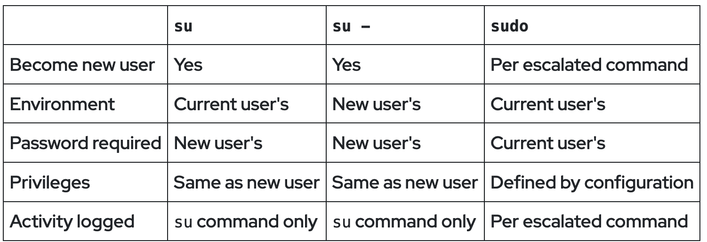
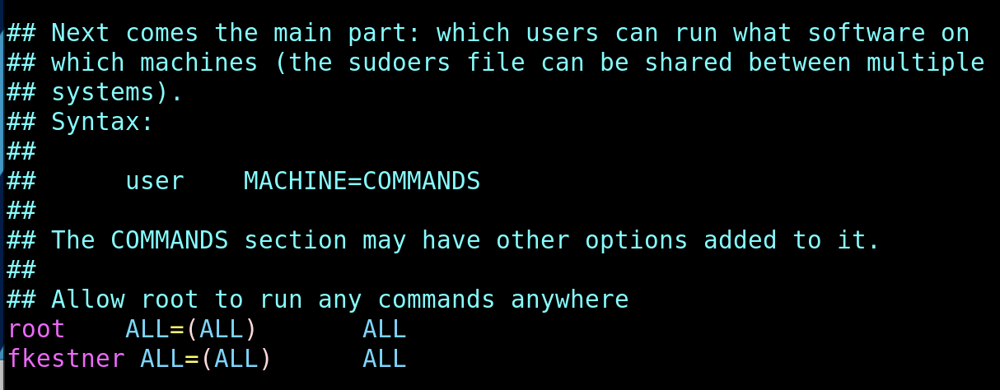
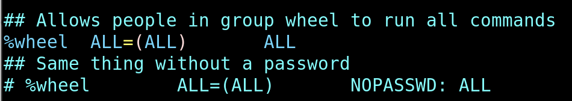
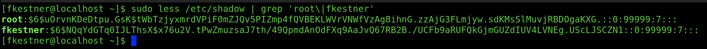
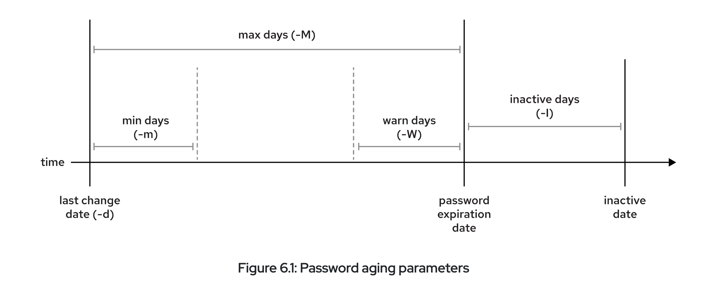
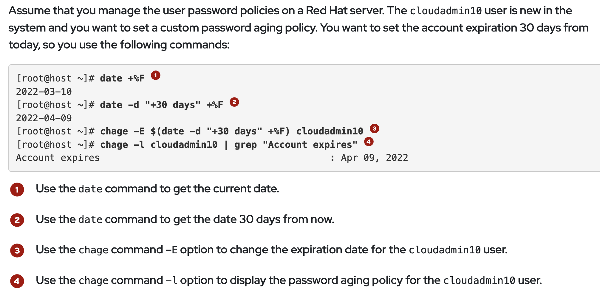
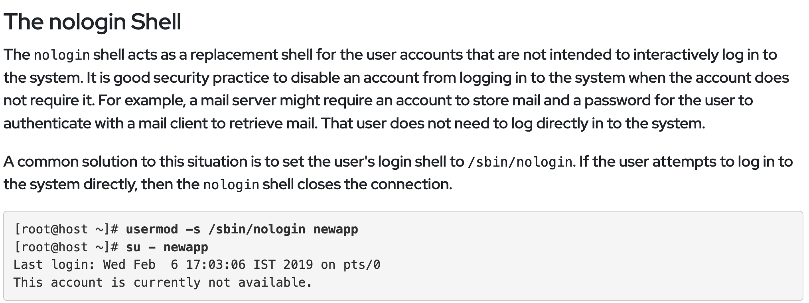

<style>
r { color: Red }
o { color: Orange }
b { color: Blue }
y { color: Yellow }
lb { color: DeepPink}
db { color: DodgerBlue}
pr { color: Purple }
</style>

<style>
body{
  font-family: PT Mono;
  background-color: #202020;
  color: White;
}</style>

# **Local Users and Groups**
## **USERS & USER IDs**
<db>UID</db> := Internally represented user ID 

&nbsp; &nbsp; &nbsp; &nbsp; -> file access

&nbsp; &nbsp; &nbsp; &nbsp; -> process maangement

&nbsp; &nbsp; <db>UID</db> [<y>0</y>]: The superuser (root) account UID

&nbsp; &nbsp; <db>UID</db> [<y>1-200</y>]: System account UID satically assigned to system processes

&nbsp; &nbsp; <db>UID</db> [<y>201-999</y>]: UIDs assigned to system processes that DO NOT OWN FILES.

&nbsp; &nbsp; <db>UID</db> [<y>1000+</y>]: UID range to assign regular, unprovileged users

### <o>id</o> [<r>OPTION</r>] -> print real and effective user and group IDs
```
    -u  := get ONLY current user UID
    -n  := print user name instead of UID 
    -G  := print only effective group ID
    -Z  := print security context (basically priveledges) 
```
+ superuser(root) => id = 0
+ user accounts   => id = 1000,1001, ... ,
&nbsp;  
&nbsp;  

&nbsp; &nbsp; Where is user location stored? -> <r>/etc/passwd</r>
```
    Storage Format: 

    | [ACCOUNT_NAME] : x : [GROUP_NUMBER] : [USER_TYPE] : [HOME_DIRECTORY] : [SHELL_BEING_USED]
    | fkestner       : x : 1000           : 1000        : /home/fkestner   : /bin/bash
```
&nbsp; 

---

## **GROUPS & GROUP IDs**
A <db>Group</db> is a <lb>collection</lb> of <lb>users</lb> with <lb>SHARED ACCESS</lb>

<db>GID</db> := Group ID		
&nbsp; &nbsp; Where is are groups stored-> <r>/etc/groups</r>

```
    Storage Format: 
        | [GROUP_NAME] : x : [GROUP_ID] : [LIST OF ADDITIONAL USERS IN GROUP]
        | fkestner     : x : 1000       :  

	%[SOME_NAME] => Anything that follows '%' is a group 
```
&nbsp; 

<lb> Every USER </lb> has <lb>ONE</lb> <db>PRIMARY GROUP</db> and <lb>CAN HAVE additional</lb> <db>SECONDARY GROUPS</db>

&nbsp; &nbsp; <db>Primary Group</db> &nbsp; := The default group created upon user creation. 

&nbsp; &nbsp; &nbsp; &nbsp; - It has the SAME NAME as the respective primary USER. 

&nbsp; &nbsp; &nbsp; &nbsp; - This <db>PG</db> is listed by <o>GID</o> in **<r>/etc/passwd</r>**

&nbsp; &nbsp; &nbsp; &nbsp; - Said USER is the ONLY MEMBER of this *User private Group* 

&nbsp; &nbsp; <db> Secondary Group</db> := Governs permissions based on user group status

&nbsp; &nbsp; &nbsp; &nbsp; - <db>SG</db>s are stored in **<r>/etc/group</r>**

&nbsp; &nbsp; &nbsp; &nbsp; - Users are granted acess based on permissions of any of their groups, regardless of <db>PG</db> or <db>SG</db>

---

## **How to change User & Get SUPERUSER(SU) Access:**
### Gaining SU Access:

### &nbsp; &nbsp; <o> su </o> {root} := 'su' switches users, and 'root' is default value

&nbsp; &nbsp; &nbsp; &nbsp; + grants TEMPORARY SU ACCESS

&nbsp; &nbsp; &nbsp; &nbsp; + Same password for EVERYBODY, must be redistributed every change in personel

&nbsp; &nbsp; &nbsp; &nbsp; + ALL commands logged under 'root'

&nbsp;
&nbsp;
### &nbsp; &nbsp; <o> sudo </o> [<r>SOME_COMMAND</r>] := Execute SOME_COMMAND with SU priveldges

&nbsp; &nbsp; &nbsp; &nbsp; + Everybody gets personal SU priveldges

&nbsp; &nbsp; &nbsp; &nbsp; + Everybody gets their PERSONAL sudo password (no need for redistribution)

&nbsp; &nbsp; &nbsp; &nbsp; + ALL commands logged under personal suo (so it is TRACEABLE)

### The Superuser (SU):
&nbsp; &nbsp; The <db>Superuser</db> is essentially a <lb> USER with ALL PRIVELEDGES</lb>. The SU is able to override normal priveledges and can be used to manage & administer a system. 

&nbsp;
&nbsp;

### Changing to a Different User: 
### &nbsp; &nbsp; <o>su</o>  - [<r>SOME_USER</r>] := switches current user to SOME_USER. 


### Differences in Each <o>su</o> | <o>su - </o>| <o>sudo</o> comands:


### Where is all this information saved? **<r>/etc/sudoers</r>** stores who are the sudo users
&nbsp;
&nbsp;  
&nbsp;  &nbsp;  <r>**</r> **<o>visudo</o>** -> the correct way to edit the sudoers file

&nbsp;  &nbsp;  &nbsp;  &nbsp;  - Opens the correct editor depending on the system -> visudo in ALMA_LINUX/REDHAT opens VIM 

&nbsp;  &nbsp;  &nbsp;  &nbsp;  - LOCKS the sudoers file against simultaneous edits 

&nbsp;  &nbsp;  &nbsp;  &nbsp;  - Performs basic VALIDITY CHECKS and syntax errors

Format Of **<r>/etc/sudoers</r>**:


&nbsp;  
&nbsp;  

### **<o>less</o>** [<r>OPTIONS</r>] [<r>FILE_PATH</r>] := goes through the file with scrolling
```
    -N := line numbers displayed
```

---

## **Manage Local User Accounts:**

### **Creation & Deletion:** 
### **<o>useradd</o>** [<r>OPTIONS</r>] [<r>USER_NAME</r>] := Creates a user named USER_NAME and a PG called USER_NAME
```
    -p, --password [PASSWORD] := Sets the password for the user
    -d, --home-dir := user will be created using HOME_DIR as the value for home directory. 
    -e, --expiredate [YYYY-MM-DD]:= the account will disabled on date [YYYY-MM-DD]
```
### **<o>usermod</o>** [<r>OPTIONS</r>] [<r>USER_NAME</r>] := Modifies a user based on given OPTIONS
```
    -a, --append := combine with '-G' to add secondary groups 
                    to the user's current set of group memberships 
                    INSTEAD of replacing set of groups.
    -d, --home [HOME_DIR] := specify the home directory for the user
    -g, --gid [GROUP] := Specify primary group
    -G, --groups [GROUPS] := Specify a comma-seperated list of SECONDARY 
                             GROUPS FOR THE USER
    -L, --lock := lock the user account
    -U, --unlock := unlock the user account
    -m, --move-home := move user's home dir

    usermod -aG [GROUP_NAME] [USER_NAME] => adds USER_NAME to [GROUP_NAME] as SG
```
### **<o>userdel</o>** [<r>OPTIONS</r>] [<r>USER_NAME</r>] := Removes USER_NAME from <r>/etc/passwd</r>, BUT leaves USER_NAME's home dir intact.
```
    -r. --remove := removes he given users home dir
    -f, --force := forces the removal of given user, even if still loged in. 
                   Also forced removal of home dir EVEN IF IT IS SHARED
```

### **Password Modification:**
### **<o>passwd</o>** [<r>OPTIONS</r>] [<r>USER_NAME</r>] := Attempts to change the password for USER_NAME
```
    -d, --delete := deletes the password for USER_NAME leaving it passwordless
    -e, --expire := expires current password, forcing USER_NAME to change it on next login

    -m, --minimum [DAYS] := sets minimum password lifetime in days
    -x, --maximum [DAYS] := sets maximum password lifetime in days
    -w, --warning [DAYS] := sets the number of days user warning given before password expiry

    -f, --force := force given operation(s)

    -S, --status := output short information about the status of the user's password.
```
---
## **Manage Local Groups:**
### **<o>groupadd</o>** [<r>OPTIONS</r>] [<r>GROUP</r>] := Creates a new group account using the specified values.
```
    -g, --gid [GID] := specifies a GID for GROUP
    -p, --password [PASSWORD] := sets group password
    -r, --system := creates a SYSTEM group
```

### **<o>groupmod</o>** [<r>OPTIONS</r>] [<r>GROUP</r>] := Changes properties of an existing group GROUP.
```
    -n, --new-name [NEW_GROUP] := changes the name of GROUP to NEW_GROUP
    -g, --gid [GID] := changes group's GID to given [GID]
    -p, --password [PASSWORD] := changes password to PASSWORD
```

### **<o>groupdel</o>** [<r>OPTIONS</r>] [<r>GROUP</r>] := Deletes GROUP from all system account files
```
    -f, --force := forces removal even if some user has GROUP as PG
```
### **Temporarily Changing Groups**: 
&nbsp;  &nbsp;  &nbsp;  &nbsp;  Useful if you want to create files under different group/user permissions.
### **<o>newgrp</o>** - [<r>GROUP</r>] := Login to a NEW group
```
    -f, --force := forces removal even if some user has GROUP as PG
```

---

## **Manage User Passwords & Account Access:**
&nbsp;  &nbsp;  Originally, encrypted passwords were stored in the world-readable /etc/passwd file. This was considered adequate until dictionary attacks on encrypted passwords became common. The encrypted passwords were moved to the <r>/etc/shadow</r> file, which only the root user can read.

``` 
File Format:
    1 | [USER_NAME]:
      | [ENCRYPTED_PASWORD]:
      | [DAYS FROM EPOCH LAST PSWD CHANGE]:
      | [MIN]:
      | [MAX]:
      | [PASSWD_WARNING_DAYS]:
      | [#_INACTIVEDAYS]:
      | [ACC_EXPIRY_DAYS_SINCE_EPOCH]:
      | [RESERVED_FOR_FUTURE_USE]
    2 |         . . .
```

---
### Format of Encrypted Password:
```
| $[HASHING_ALGO_USED]$[SALT]$[ENCRYPTED_HASH]
```
&nbsp;  &nbsp;  To verify a password the system adds <db>salt</db> to the types password, encrypts it, and THEN compares it to the <lb>ENCRYPTED PASSWORD</lb>

### Configure Password Aging:

### **<o>chage</o>** [<r>OPTIONS</r>] [<r>LOGIN</r>] := Alters user password expiry information
```
    -d, --lastday [LAST_DAY] := last day (since epoch) password was changed.
                                if [LAST_DAY] = 0, USER forced to change password.
                                can be expressed as (YYYY-MM-DD)
    -E, --expiredate [EXPIRE_DATE] := days (since epoch) when password wille expire.
                                      can be expressed as (YYYY-MM-DD)

    ** REFER TO 'passwd' COMMAND FOR MORE OPTIONS
```
	


### Cool Way to Remove Login Permissions for a User: 
