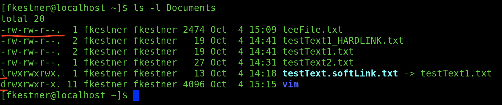
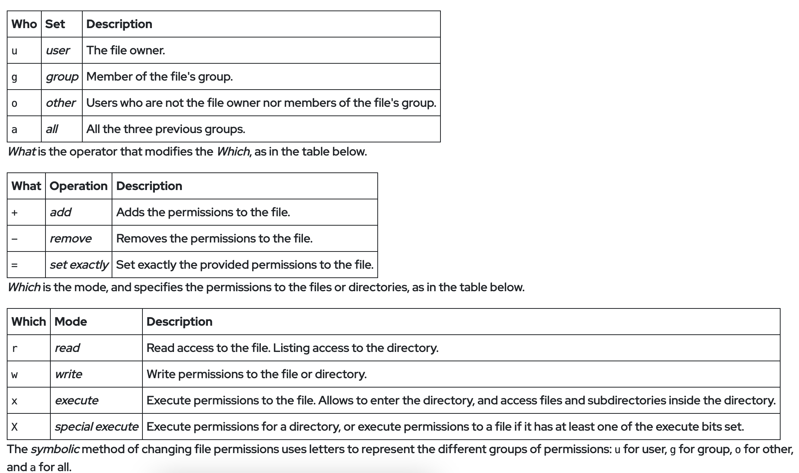
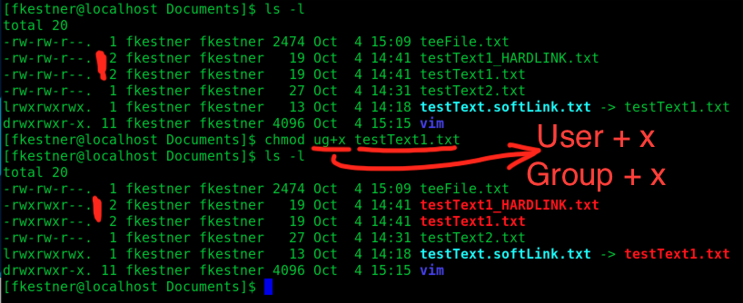
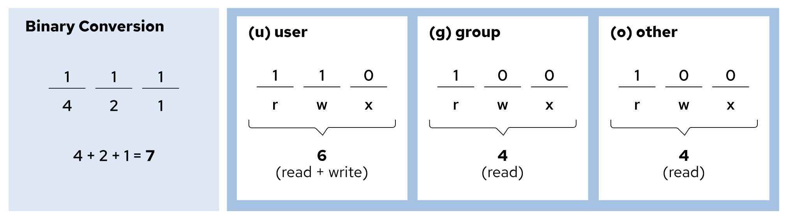
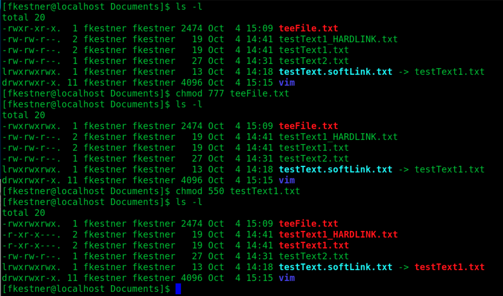
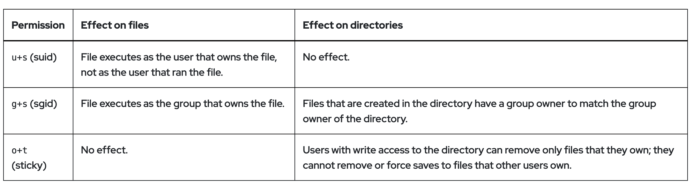
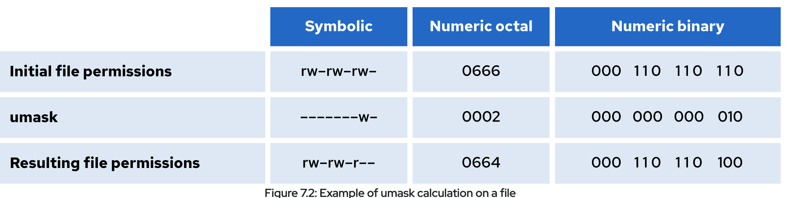
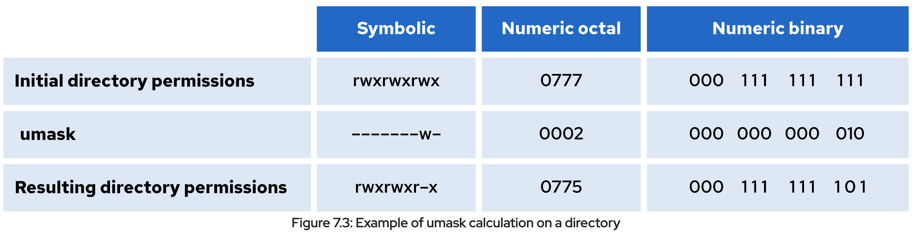

<style>
r { color: Red }
o { color: Orange }
b { color: Blue }
y { color: Yellow }
lb { color: DeepPink}
db { color: DodgerBlue}
pr { color: Purple }
</style>

<style>
body{
  font-family: PT Mono;
  background-color: #202020;
  color: White;
}</style>

# **Controlling File Access & Permissions**

## Interpret File Permissions: 
&nbsp; &nbsp; There are 3 types of file permissions:

&nbsp; &nbsp; &nbsp; &nbsp;  <r>r</r> read : Read file contents and contents of directory can be listed

&nbsp; &nbsp; &nbsp; &nbsp;  <r>w</r> write : Alter file contents and create/delete files in directory

&nbsp; &nbsp; &nbsp; &nbsp;  <r>x</r> execute : Execute file as commands and directory can become working directory


Permissions are Listed as:
```
[FILE_TYPE_CHAR]rwxrwxrwc

```
&nbsp; &nbsp; &nbsp; &nbsp; [<r> FILE_TYPE_CHAR </r>] :=

&nbsp; &nbsp; &nbsp; &nbsp; &nbsp; &nbsp; &nbsp; &nbsp; **<y>-</y>** : a regular file

&nbsp; &nbsp; &nbsp; &nbsp; &nbsp; &nbsp; &nbsp; &nbsp; **<y>d</y>** : a directory

&nbsp; &nbsp; &nbsp; &nbsp; &nbsp; &nbsp; &nbsp; &nbsp; **<y>l</y>** : symbolic link

&nbsp; &nbsp; &nbsp; &nbsp; &nbsp; &nbsp; &nbsp; &nbsp; **<y>c</y>** : character device file

&nbsp; &nbsp; &nbsp; &nbsp; &nbsp; &nbsp; &nbsp; &nbsp; **<y>b</y>** : block device file

&nbsp; &nbsp; &nbsp; &nbsp; &nbsp; &nbsp; &nbsp; &nbsp; **<y>p</y>** : named pipe file

&nbsp; &nbsp; &nbsp; &nbsp; &nbsp; &nbsp; &nbsp; &nbsp; **<y>s</y>** : local socket file
&nbsp;  
&nbsp;  
 

---

## Alter File Permissions from the Command Line: 

### **<o>chmod</o>** [<r>OPTIONS</r>] [<r>MODE</r>] [<r>FILE</r>] := change file permissions
```
    -c, --changes := like verbose but only report when change is made
    -v, --verbose := output diagnostec for ALL PROCESSED FILES
    -f, --silent, --quiet := supress MOST error messages

    -R, --recursive := change files & directories RECURSIVELY
```
[<r>MODE</r>] := WHO / WHAT / WHICH



### <pr>chmod EXAMPLE:</pr>


Some interesting things happened here

- testText.txt <r>changed permissions</r>
- testText_HARDLINK.txt <r>changed permissions</r>
  
&nbsp; &nbsp;** THIS MEANS THAT <o>chmod</o> WILL CHANGE <db>HARDLINKS</db>
&nbsp; 
&nbsp; 
### **chmod in OCTAL MODE:**


```
chmod ### [FILE_NAME] -> ? ??? ??? ???
```


##  1 1 1 | 1 1 1 | 1 1 1 
##  R W X | R W X | R W X 
&nbsp; 
&nbsp; 
## OCT: &nbsp; 5&nbsp; &nbsp;|&nbsp; &nbsp;4&nbsp;&nbsp; |&nbsp;&nbsp;  1
## BIN: 1 0 1 | 1 0 0 | 0 0 1
## RES: R - X | R - - | - - X
&nbsp; 
&nbsp; 

## 7 -> rwx | 3 -> -wx

## 6 -> rw- | 2 -> -w-

## 5 -> r-x | 1 -> --x

## 4 -> r-- | 0 -> ---

## <pr>Examples</pr>:

&nbsp; 

---

## Change File & Directory Ownership:

### **<o>chown</o>** [<r>OPTIONS</r>] [<r>OWNER</r> <lb>[:GROUP]</lb>] [<r>FILE</r>] := change file owner AND group
```
    -c, --changes := like verbose but only report when change is made
    -v, --verbose := output diagnostec for ALL PROCESSED FILES
    -f, --silent, --quiet := supress MOST error messages

    --dereference := affect the referant instead of symbolic link (IS DEFAULT)
    -h, --no-derefernece := affect actual symbolic link and NOT referant

    --from=[CURRENT_OWNER:CURRENT_GROUP] := change only if owner/group matches 
                                            given CURRENT_WONER or CURRENT_GROUP

    -R, --recursive := operate recursively

    -H := if cmd line argument is a symbolic link to a dir, TRAVERSE IT
    -L := traverse EVERY symbolic link to a directory encountered
    -P := DO NOT traverse any symbolic link (IS DEFAULT)
```
&nbsp; 

--- 
## Manage DEFAULT Permissions & File Access:
### Special File Permissions:


### **<o>umask</o>** [<r>####</r>] := displays the systems current <db>umask</db> or changes it if [<r>####</r>] is specified..

&nbsp; &nbsp; A <db>umask</db> is what dictates the <lb>DEFAULT FILE PERMISSIONS</lb> of the system. An imporant thing to note is that <db>umask</db> can <r> ONLY REMOVE PERMISSIONS FROM DEFAULT</r>. That means that you <r>cannot</r> <y>ADD</y> executable (<r>x</r>) permissions to files using <db>umask</db>.





