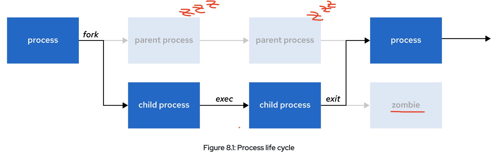
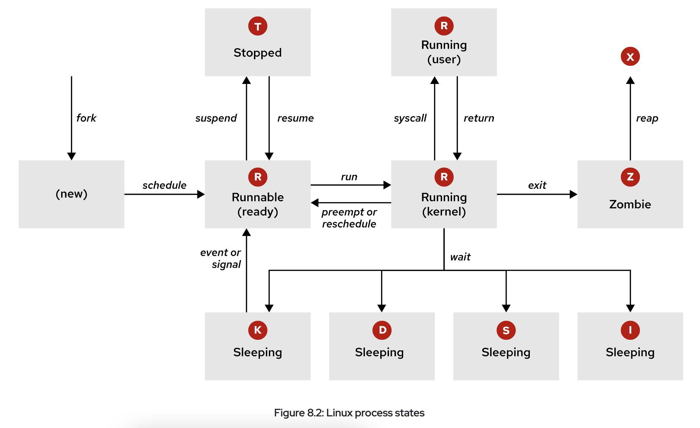
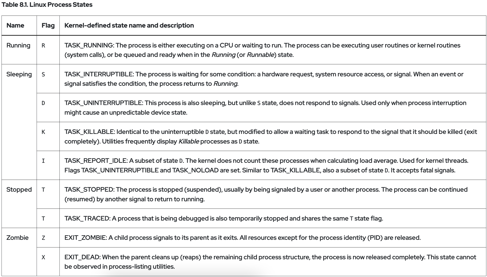
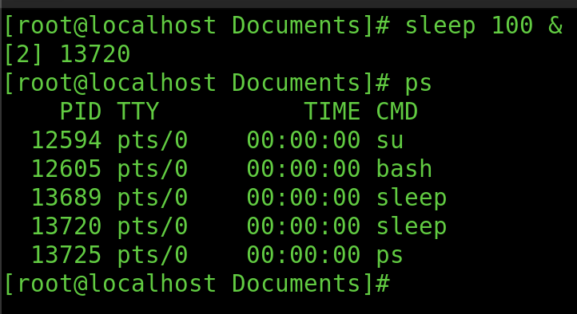
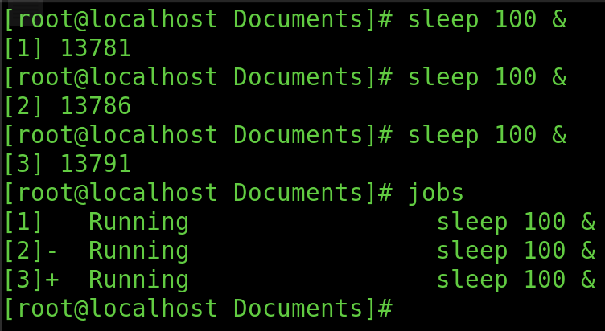
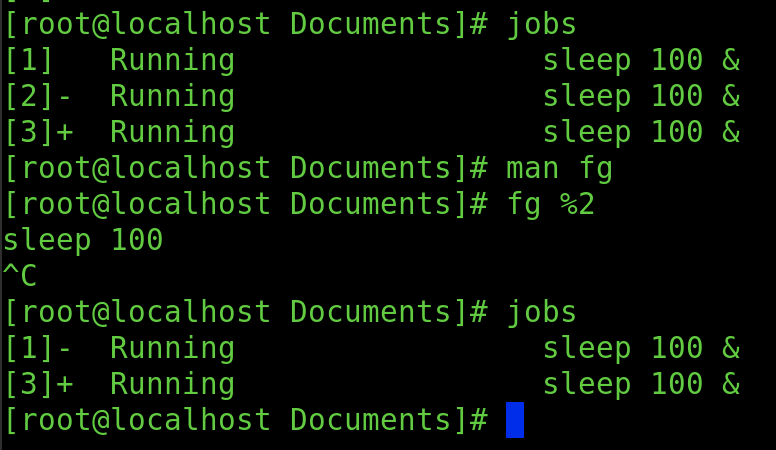
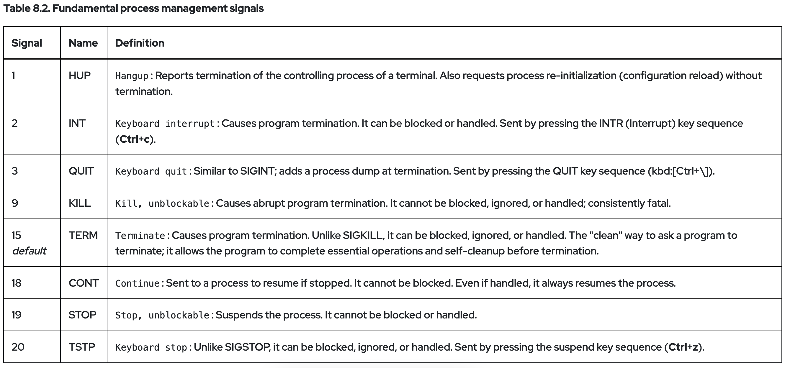
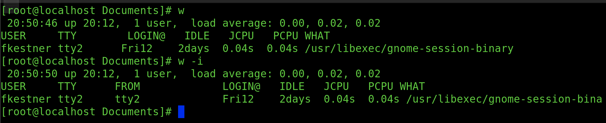
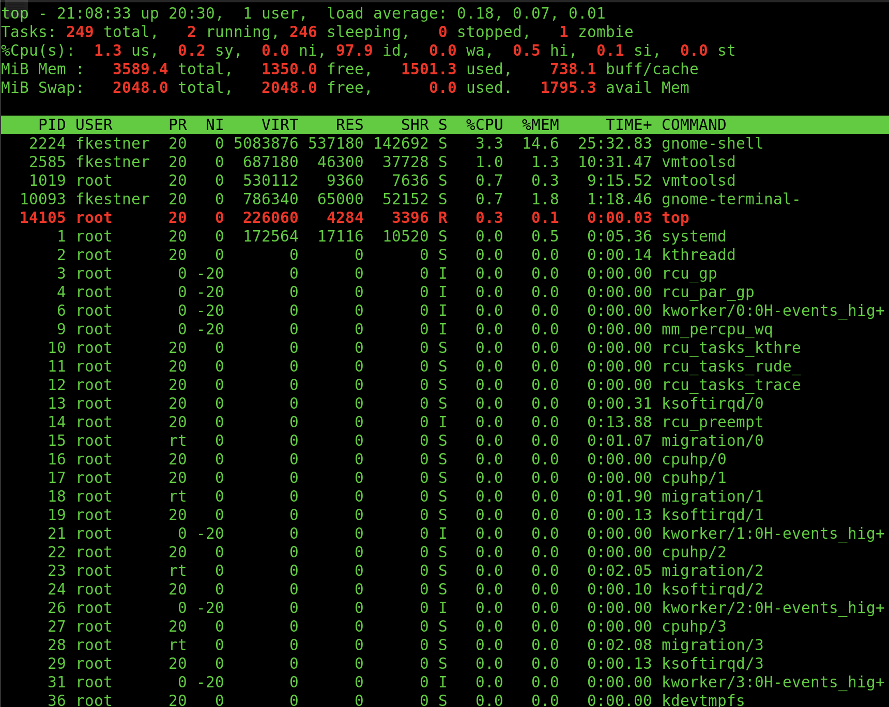
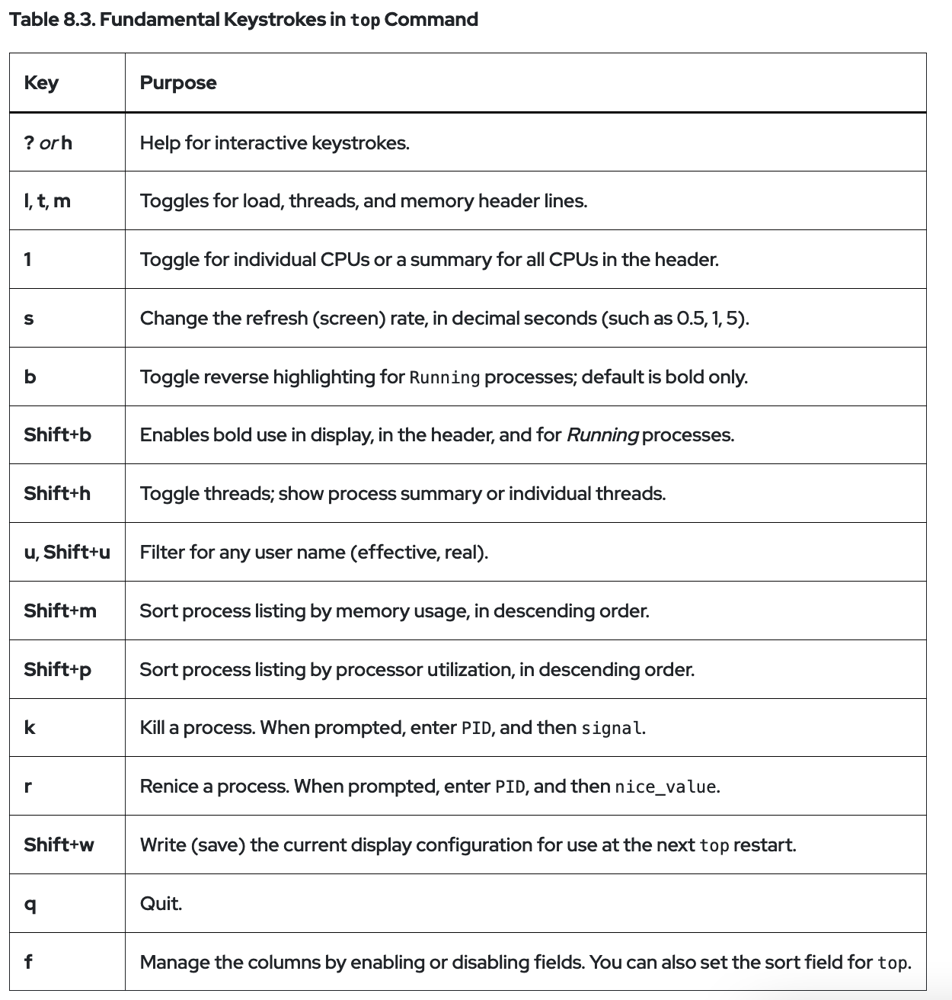

<style>
r { color: Red }
o { color: Orange }
b { color: Blue }
y { color: Yellow }
lb { color: DeepPink}
db { color: DodgerBlue}
pr { color: Purple }
</style>

<style>
body{
  font-family: PT Mono;
  background-color: #202020;
  color: White;
}</style>

# Monitor and Manage Linux Processes: 

## Defining a <db>Process</db>: 
&nbsp; &nbsp; A <db>process</db> is a <lb>running</lb> instance of a launched and executable program. 

&nbsp; &nbsp; &nbsp; &nbsp; Upon Creation, Consists of: 

&nbsp; &nbsp; &nbsp; &nbsp; 1. An <y>address</y> of allocated memory

&nbsp; &nbsp; &nbsp; &nbsp; 2. <y>Security properties</y> including permissions and ownership 

&nbsp; &nbsp; &nbsp; &nbsp; 3. One or more <y>execution threads</y> of program code

&nbsp; &nbsp; &nbsp; &nbsp; 4. A process <y>state</y> 

&nbsp; &nbsp; 

&nbsp; &nbsp; &nbsp; &nbsp; The <db>environment</db> of a <db>process</db> is a list of information including: 

&nbsp; &nbsp; &nbsp; &nbsp; 1. Global and local variables 

&nbsp; &nbsp; &nbsp; &nbsp; 2. Current scheduling context

&nbsp; &nbsp; &nbsp; &nbsp; 3. Allocated system resources (file descriptors, network ports)


&nbsp; &nbsp; 

Any process can <db>fork</db> in order to <lb>spawn</lb> a <db>child process</db>. 

&nbsp; &nbsp; &nbsp; &nbsp; <db>fork</db> := duplicate it's own address space

&nbsp; &nbsp; &nbsp; &nbsp; <db> child process</db> := a process created by a <db>parent process</db> (RELATIVE)




### Child Process Creation & Management: 

<r> 1. </r> Through a <db>fork</db> the <db>CHILD</db> inherits:

- security identities
- previous and current file descriptos
- port and resource priveleges
- envrionment variables
- program code

&nbsp; &nbsp; NOW THE <db>CHILD</db> CAN <lb> EXECUTE ITS OWN PROGRAM CODE</lb>! 


<r>2.</r> NORMALLY <db>PARENT</db><lb> SLEEPS</lb> WHILE <db>CHILD</db> <lb>RUNS</lb>

&nbsp; &nbsp; `wait request` is set upon <db>fork</db> and <lb>signalled</lb> upon <db>CHILD</db><r> COMPLETION</db>

<r>3.</r> When <db>CHILD</db> <r>EXITS</r>
1. it closes or discards its resources and environment
2. leaves a <r>ZOMBIE RESOURCE</r> (:= entry in process table)
3. <db>PARENT</db> is <lb>SIGNALED TO WAKE</lb> &  CLEANS process table of <db>child</db> entry.
4. <db>PARENT</db> continues its own program code execution


<r>**</r> A process which has <r>NO</r> <db>PARENT PROCESS</db> is referred to as a <r>zombie</r> process

&nbsp; &nbsp; 

---
## Describing Process States: 
### Each CPU/CPU-Core can run a single <db>process</db> at a time. Immediate process requirments for <y>CPU time</y> & <y>resource allocation</y> constantly change. As such the <lb>states of a</lb> <db>process</db> are also <lb>always changing</lb> as cirumstances dictate.

&nbsp; &nbsp; 

### **Linux Process States in Detail:** 



### <o>ps</o> [<r>OPTION</r>] := report a snapshot of the current processes
```
    -aux := list EVERY process using BSD syntax
    -lax := provides a long listing and displays faster
    -ef  := display all processes
    -j   := displays information about jobs 
            ( PPID | PID | PGID | SID | TTY | TGPID | STAT | UID | TIME | COMMAND )
                                                       ^^(Process State Letter)

    -O [FORMAT] := sorts by given format 
```

### <o>pstree</o> [<r>OPTION</r>] := display a TREE of processes
```
    -g := show PGIDs
    -p := show PIDs
```

---

## Control Jobs:

Any <lb>command</lb> OR <lb>pipeline</lb> can be STARTED IN <r>BACKGROUND</r> by appending an <r>ampersand</r> (<r>&</r>) to it. Bash <y>displays job number</y> (unique to session) and <y> child process</y> <db>PID</db>




### <o>jobs</o> := dissplays the list of jobs for current shell session


### <o>fg</o> %[<r>JOB #</r>]:= brings <r>JOB $</r> into the foreground


### <o>bg</o> %[<r>JOB #</r>]:= STARTS RUNNING SUSPENDED PROCESS <r>JOB #$</r> 

&nbsp;  

### <r>**</r> **`CTR-Z`** -> Generates a <r>SUSPEND REQUEST</r> for current fg process

---

## Kill Processes: 
&nbsp;  &nbsp;  A <db>signal</db> is a <lb>software interrupt delivered to</lb> a <lb>PROCESS</lb>. Evens that can generate signals include an <pr> error</pr>, an <pr>external event</pr> (IO req. or expired timer) or by EXPLICTELY SENDING A SIGNAL. 

Each <db>signal</db> has a DEFAULT BEHAVIOR, usually:

&nbsp; &nbsp; &nbsp; &nbsp; &nbsp; &nbsp; &nbsp; &nbsp; 1. <y>Term</y>: Terminate a program (<r>exit</r>) at once.

&nbsp; &nbsp; &nbsp; &nbsp; &nbsp; &nbsp; &nbsp; &nbsp; 2. <y>Core</y>: Save memory image (<db>core dump</db>), then terminate

&nbsp; &nbsp; &nbsp; &nbsp; &nbsp; &nbsp; &nbsp; &nbsp; 3. <y>Stop</y>: Stop a running program (<r>suspend</r>) and wait to continue (<r>resume</r>).




&nbsp;  


### <o>kill</o> [<r>OPTION</r>] [<r>NAME</r>/<r>PID</r> of P to Kill] := terminate a process
```
    -s, --signal [signal] := provides the signal to send (given as name or number)


    -p, --pid := only print the PID of named process, DO NOT SEND SIGNAL
    --verbose := print PID(s) that will be signaled with kill and SEND SIGNAL
```
&nbsp;  &nbsp;  ** Each <db>PID</db> can express as:

&nbsp;  &nbsp;  &nbsp;  &nbsp;  <r>n</r> &nbsp;:= (n>0) | <db>PID</db> <r>n</r> is signalled 

&nbsp;  &nbsp;  &nbsp;  &nbsp; <r>0</r> &nbsp;:= all processes in current process group are signalled

&nbsp;  &nbsp;  &nbsp;  &nbsp; <r>-1</r> := all process with <db>PID</db> > 1 are signalled

&nbsp;  &nbsp;  &nbsp;  &nbsp;  <r>+n</r> := (n>0) | All process in process group <r>n</r> are signalled

&nbsp;  &nbsp;  &nbsp;  &nbsp;  <r>NAME</r> := process <r>NAME</r> will be signalled

&nbsp;  

### <o>killall</o> [<r>OPTION</r>] [<r>NAME</r>] := kill processes by NAME
```
    -I, --ignore-case := ignore case when searching 
    -e, --exact := requires an EXACT match.
                   ** If a command is > 15 chars the full name may be unavailable at which
                      case it will KILLALL THAT MATCHES FIRST 15 CHARS. '-e' will SKIP
                      these entries but will specify which are skipped if using '-v'.

    -i, --interactive := ask for confirmation for each kill

```
&nbsp;  
&nbsp;  

### <o>pkill</o> [<r>OPTION</r>] [<r>PATTERN</r>] := send signal to each process instead of listing to stdout
&nbsp;  
### <o>pgrep</o> [<r>OPTION</r>] [<r>PATTERN</r>] := looks through currently running processes and lists the PIDs which match [<r>PATTERM</r>] to stdout
&nbsp;  
### <o>pidwait</o> [<r>OPTION</r>] [<r>PATTERN</r>] := will WAIT for each process instead of listing to stdout
```
    -u, --euid [euid] := only match process whose EUID is given (numerical or sumbolic value)
    -U, --uid [uid]   := only match process whose UID is given (numerical or symbolic value)

    -g, --pgroup [pgroup] := only match process in PGIDs listed
    -G, --group [GID] := only match process in GIDs listed
    
pkill EXCLUSIVE:
    -e, --echo := disply NAME and PID of process being killed 
    -[SIGNAL] OR --signal [SIGNAL] := dictates which signal to send to each process
```

---

## Administratively Log Out Users:

### 1: Identify Login Session:
### &nbsp; &nbsp;    <o>w</o> [<r>OPTION</r>] := Show who is logged on and what they are doing
```
    -s, --short := display in short format
    -i, --ip-addr := display IP address instead of host name for 'from' field
```



### 2: Identify PID Numbers to Kill :

&nbsp;  &nbsp;  Using <o>pgrep</o> we get all of 'bob's processes


```
    [root@host ~]# pgrep -l -u bob
    6964 bash
    6998 sleep
    6999 sleep
    7000 sleep
    . . . . . .
```

### 3: Execute Kill Command:

```
    . . . . . .
    [root@host ~]# pkill -SIGKILL -u bob
    [root@host ~]# pgrep -l -u bob
```
&nbsp;  

### <r>**</r> Instead of killing all processes you could also just <lb>KILL TERMINAL ID</lb>
```
    [root@host ~]# pgrep -l -u bob
    7391 bash
    7426 sleep
    7427 sleep
    7428 sleep
    [root@host ~]# w -h -u bob
    bob      tty3      18:37    5:04   0.03s  0.03s -bash
    [root@host ~]# pkill -t tty3
    [root@host ~]# pgrep -l -u bob
    7391 bash
    [root@host ~]# pkill -SIGKILL -t tty3
    [root@host ~]# pgrep -l -u bob
    [root@host ~]#
```


### <r>**</r> This process for killing parents to kill children is VERY USEFUL
```
    [root@host ~]# pstree -p bob
    bash(8391)─┬─sleep(8425)
            ├─sleep(8426)
            └─sleep(8427)
    [root@host ~]# pkill -P 8391
    [root@host ~]# pgrep -l -u bob
    bash(8391)
    [root@host ~]# pkill -SIGKILL -P 8391
    [root@host ~]# pgrep -l -u bob
    bash(8391)
```

---

## Monitor Process Activity: 

### <db>Load Average</db>: The measurement Linux provides to represent <lb>percieved system load</lb> of a given process.

&nbsp;  
&nbsp;  &nbsp;   Calculating <db>Load Average</db>: 

&nbsp;  &nbsp;  &nbsp; &nbsp;   <r>AVG</r>(# of process in <db>R</db> (ready to run) state or <db>D</db> (waiting for I/O to complete) state.

&nbsp;  &nbsp;  &nbsp; &nbsp;   <r>AVG</r>(#<db>R</db>_processes + #<db>D</db>_processes)

&nbsp; 

### <o>uptime</o> [<r>OPTION</r>] := Tell how long sys. has been running INCLUDING <db>load average</db>

```
    [user@host ~]$ uptime
    15:29:03 up 14 min,  2 users,  load average: 2.92, 4.48, 5.20top
                                  time(min) = .   ^5    ^10   ^ 15 
```

### <o>top</o> := displays linux processes


ß