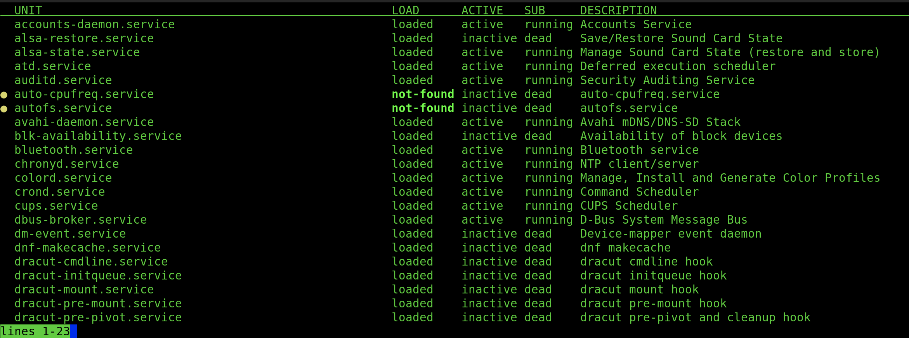

<style>
body{
  font-family: PT Mono;
  background-color: #202020;
  color: White;}
}</style>

<style>
r  { color: Red }
o  { color: Orange }
b  { color: Blue }
y  { color: Yellow }
lb { color: DeepPink}
db { color: DodgerBlue}
pr { color: MediumOrchid}
aq { color : Aqua}
gr { color : ForestGreen}

hblue{background-color:DodgerBlue;
color: black;

}
</style>

# **Control Services & Deamons**

### &nbsp; &nbsp; A **<db>daemon</db>** is a <lb>process</lb> that either <lb>waits or runs **IN THE BACKGROUND**</lb>. Generally <db>deamons</db> begin on startup and run until shutdown (or manually terminated). 

<r>**</r>Convention dictates that <db>daemons</db> end with the letter '<y>d</y>'

&nbsp;  

<strong><pr>systemd</pr></strong> : the <db>daemon</db> that manages <y>startup processes for Linux</y>. Activates <lb>system resources</lb>, <lb>server daemons</lb> and <lb>other</lb> processes both on startup and on a running system. 

<pre><strong><pr>systemd</pr></strong> uses <em><db>UNITS</db></em> to manage different types of objects:

    <em><y>.service</y></em> := system services

    <em><y>.socket</y></em>  := inter process communication (<db>IPC</db>) 
                sockets that <pr>systemd</pr> should monitor. 

    <em><y>.path</y></em>    := delays activity until SPECIFIC 
                file-system change occurs  
</pre>


### **<o>systemctl</o>** [<r>OPTION</r>] [**<r>COMMAND</r>** [<r>UNIT</r>]] := control systemd system and service manager
```
    -t, --type=[VALUE] := filters by UNIT
            [VALUE], comma seperateed list of unity types (such as service and socket)

    --state=[VALUE] := filters by LOAD

    -a, --all := display ALL processes

    -r, --recursive := also show units of local containors 
```
<pre>
<strong><r>COMMANDS</r>:</strong>
    <font size = 4><strong>Retrieve:</strong></font>
    <strong><aq>list-units</aq></strong> [<r>PATTERN</r>]   := lists ALL units that <pr>systemd</pr> has in memory
    <strong><aq>list-sockets</aq></strong> [<r>PATTERN</r>] := lists sockets that <pr>systemd</pr> has in memory 
    <strong><aq>list-timers</aq></strong> [<r>PATTERN</r>]  := lists timers that <pr>systemd</pr> has in memory, 
                             ordered by which ones will elapse next

    <strong><aq>list-dependencies</aq></strong> [<r>PATTERN</r>] := lists dependancies of the service 
                                   specified by [<r>PATTERN</r>].
    
        <i>Further Filtering</i>:
            <y>--type</y>=[<r>VALUE</r>]  } Filters by <strong><gr>UNIT</gr></strong>
            <y>--state</y>=[<r>VALUE</r>] } Filters by <strong><gr>SUB</gr></strong>
            <y>--all</y>           } Lists all active (default) and INACTIVE

    <strong><aq>is-active</aq></strong> [<r>PATTERN</r>] := checks whether <lb>matching processes are <i>ACTIVE</i></lb>
                           <y>returns</y> <r>exit code</r> : <r>0</r>, at least 1 is <i><lb>ACTIVE</lb></i>
                           <y>returns</y> <r>exit code</r> : <r>>0</r>, otherwise
                           <i>UNLESS</i> '<r>--quite</r>' specified

    <strong><aq>is-failed</aq></strong> [<r>PATTERN</r>] := check whether <lb> matching processes are <i>INACTIVE</i></lb>
                           <y>returns</y> <r>exit code</r> : <r>0</r>, at least 1 is <i><lb>INACTIVE</lb></i>
                           <y>returns</y> <r>exit code</r> : <r>>0</r>, otherwise
                           <i>UNLESS</i> '<r>--quite</r>' specified


    <font size = 4><r>VERY USEFUL & IMPORTANT</r></font>
    <r>****************************************************************</r>
    <strong><aq>status</aq></strong> [<r>PATTERN</r> | <strong><db>PID</db></strong>]:= shows <lb>runtime information</lb> on specified 
    

    <strong><aq>list-dependencies</aq></strong> [<r>PATTERN</r>] := lists the <db>dependencies</db> of the process 
                                   specified by [<r>PATTERN</r>]
    <r>****************************************************************</r>

    -------------------------------------------------------------------------
    <font size = 4><strong>Control:</strong> </font>
    <strong><aq>start</aq></strong> [<r>PATTERN</r>]   := start/activate UNITs specified by [<r>PATTERN</r>]
    <strong><aq>stop</aq></strong> [<r>PATTERN</r>]    := stop/deactivate UNITs specified by [<r>PATTERN</r>]

    <strong><aq>reload</aq></strong> [<r>PATTERN</r>]  := reload of configuration, UNITs specified by [<r>PATTERN</r>]
    <strong><aq>restart</aq></strong> [<r>PATTERN</r>] := start THEN stop UNITS specified by  [<r>PATTERN</r>]
    <strong><aq>reload-or-restart</aq></strong> [<r>PATTERN</r>] := reload, OTHERWISE RESTART

    -------------------------------------------------------------------------
    <font size = 4><strong>Masking:</strong></font>
    A system can have MULTIPLE services which <r>CONFLICT</r> with eachother. 
    To avoid starting a service which conflicts with another it uses <aq>masking</aq>. 
    <aq>Masking</aq> creates a <y> link in the confid dirs, TO</y> '<pr>/dev/null</pr>' file, 
    which <r>PREVENTS SERVICES FROM STARTING</r>.

    <strong><aq>mask</aq></strong> [<r>PATTERN</r>] := masks service which matches [<r>PATTERN</r>]
    <strong><aq>unmask</aq></strong> [<r>PATTERN</r>] := unmasks service which matches [<r>PATTERN</r>]

    -------------------------------------------------------------------------
    <font size = 4><strong>Enable/Disable on Boot:</strong></font>
    <strong><aq>enable</aq></strong> [<r>PATTERN</r>] := unmasks service which matches [<r>PATTERN</r>]
    <strong><aq>disable</aq></strong> [<r>PATTERN</r>] := unmasks service which matches [<r>PATTERN</r>]
        <y>--now</y>  } Filters by <strong><gr>UNIT</gr></strong>

    <strong><aq>is-enabled</aq></strong> [<r>PATTERN</r>] := check whether service which matches 
                            [<r>PATTERN</r>] is enabled/disabled.
                    <y>returns</y> <r>exit code</r> : <r>0</r>, at least 1 is <i><lb>ENABLED</lb></i>
                    <y>returns</y> <r>exit code</r> : <r>>0</r>, otherwise
                    <i>UNLESS</i> '<r>--quite</r>' specified

</pre>

&nbsp;  
&nbsp;  

---

## **Retrieving System Information:** 
### <pr> systemctl list-units --type=service --all</pr>


<pre>
    <strong><gr>UNIT</gr></strong>        := The service unit name.

    <strong><gr>LOAD</gr></strong>        := Whether <pr>systemd</pr> properly parsed the unit's 
                   configuration and loaded the unit into memory.

    <strong><gr>ACTIVE</gr></strong>      := <strong>HIGH-LEVEL</strong> activation. Indicates whether the 
                   unit started successfully.

    <strong><gr>SUB</gr></strong>         := The <strong>LOW-LEVEL</strong> activation state. More detailed 
                   info, varies based on unit type, state, 
                   how the unit is executed.

    <strong><gr>DESCRIPTION</gr></strong> := The short description of the unit.
</pre>

### **Service States:**


&nbsp;  
&nbsp;  


### <pr>sytemctl list-sockets --all</pr>


&nbsp;  
&nbsp;  

### <pr>sytemctl list-timers --all</pr>


&nbsp;  
&nbsp;   

### <pr>systemctl status mcelog.service</pr>

<pre>
    <strong><gr>FIELD</gr></strong>    := Description

    <strong><gr>LOADED</gr></strong>   := Whether the service is loaded into memory 

    <strong><gr>ACTIVE</gr></strong>   := Whether the service unit is running and if so, for how long.

    <strong><gr>DOCS</gr></strong>     := Where to find more information about the service.

    <strong><gr>MAIN PID</gr></strong> := The main process ID of the service, including the command name.

    <strong><gr>STATUS</gr></strong>   := More information about the service.

    <strong><gr>PROCESS</gr></strong>  := More information about related processes.

    <strong><gr>CGROUP</gr></strong>   := More information about related control groups.
</pre>

---

## **Controlling System Services:**

<pr> Killing a Service:</pr>


